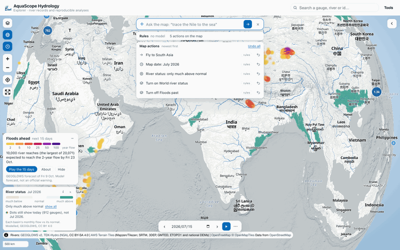
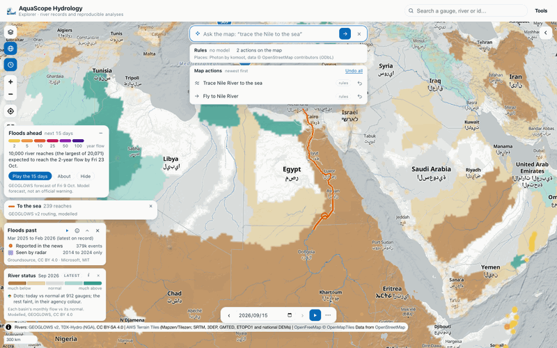
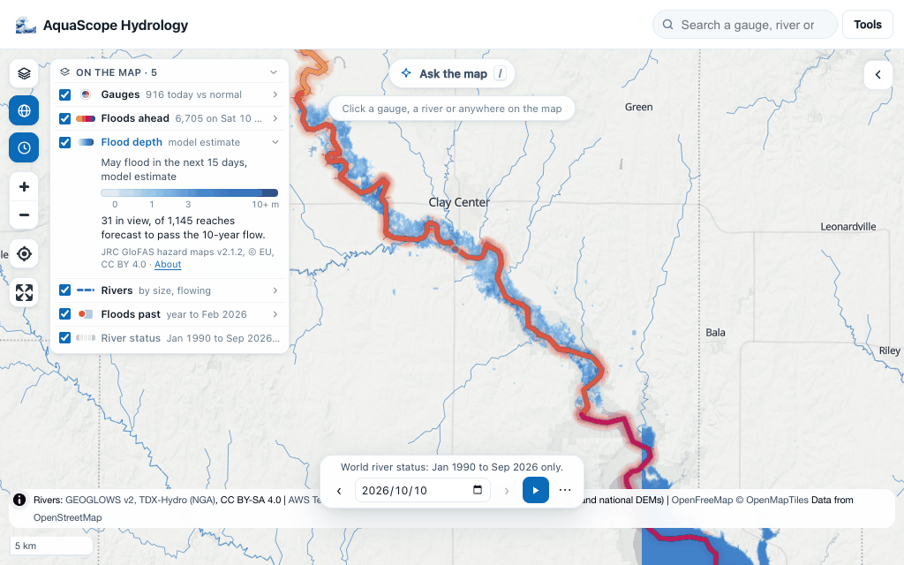
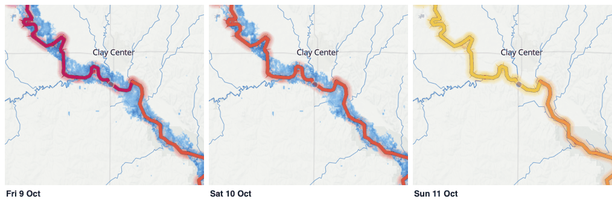
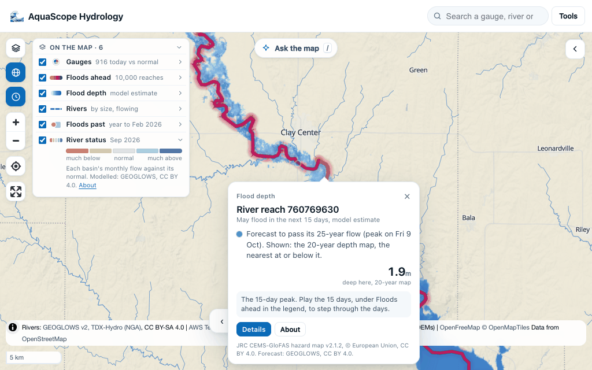

# The Explorer: click any gauge on Earth, nothing to install

**Live:** [rekin226-aquascope-explorer.static.hf.space](https://rekin226-aquascope-explorer.static.hf.space/)
(a copy also runs under [/explorer/app/](https://rekin226.github.io/aquascope/explorer/app/) on this docs site).

A static page, no server. It reads the station catalog from the
[Archive](archive.md) with DuckDB-WASM, shows every station on a MapLibre map,
and when you click one it fetches the observed record from the agency and runs
aquascope in your browser (Pyodide) to compute:

- the hydrograph and annual maxima,
- flood frequency: GEV by L-moments and Log-Pearson III with analytical 90 %
  confidence limits, plus an optional bootstrap GEV band (1,000 refits, on
  demand),
- the flow-duration curve with Q95 / Q10,
- a Mann-Kendall trend with Sen's slope on the annual means,
- and a "Methods and citations" panel naming exactly what was computed and the
  references, so the numbers are defensible in a report.

The full record is fetched by default; the **Period** control on the record card
cuts it to the last 40 or 20 years. Every result has a permalink
(`#s=<source>/<station_id>`, plus `&yr=40` or `&yr=20` for a shorter period), a
CSV download, an **Export for…** menu that writes the record as inputs for HEC-HMS, HEC-RAS,
HEC-SSP, SWMM, MODFLOW 6, Delft-FEWS or Raven ([engineering exports](engineering_exports.md)),
and a link to the agency page. Data licence and attribution are shown per source.

Click anywhere that is not a gauge and you get the **hydrology of that point**
(`#p=<lat>,<lon>`): ERA5 rainfall and temperature, FAO-56 reference
evapotranspiration and the aridity class, a monthly climate chart, GloFAS
modelled discharge with an indicative return-period table (clearly labelled
as a model, not a gauge), and the nearest gauges to click next. All from
Open-Meteo, keyless.

Stations already mirrored in the [Archive](archive.md) load from it (one small
file) instead of from the agency, so they are faster and do not add load
upstream.

## My data: your own record, the same analyses

**My data** (top left) is the other half of the app. Drop a CSV or an Excel
export, paste a table, or send the gauge you are looking at. `aquascope.ingest`
works out which column is the date and which is the value, converts to SI and
shows a QA report (gaps, duplicates, flat runs, outliers, units) before anything
is computed. Then the [workbench](https://github.com/Rekin226/aquascope/blob/main/aquascope/workbench.py)
analyses appear by tab:

| tab | analyses |
| --- | --- |
| Quality | exploratory summary, quality report, preprocessing, insights, the WHO drinking-water screen |
| Hydrology | flow-duration curve, baseflow separation (Lyne-Hollick, Eckhardt, UKIH), recession, flow signatures, FAO-56 ET0 and irrigation scheduling |
| Extremes | GEV flood frequency, return periods (GEV / LP3 / Gumbel with confidence limits and the empirical points) |
| Groundwater | standardised groundwater index with drought events, water-table-fluctuation recharge, Theis drawdown |

Each has its own parameters, a chart, a JSON download, and its methods and
citations, accumulated for whatever you actually ran. **Nothing is uploaded**:
the file is read in your tab and the analysis runs there.

These are the same functions the Streamlit dashboard used to own, so
`aquascope dashboard`, the MCP server, `aquascope ask` and this page all run one
implementation rather than four that drift. The public Streamlit deployments
have been retired in favour of this.

## The shell

The map is the page. It fills the window, and the layer rail, the inspector and
the Analyst float over it as cards, so the map is the first thing you see and
opening a panel never takes width from it. The rail (the stacked-squares button
at the top left) is closed on arrival and groups its controls under **Sources**,
**Basemap**, **Relief**, **Overlays** and **Credits**; the chevron at the top
right folds the inspector away or brings it back. The inspector starts folded:
a click answers in the map card below, and its **Details** button opens the
inspector on the right tab. On a phone the map keeps the screen and the
inspector is a bottom sheet.

The world view is a **globe**, because the coverage is worldwide and thin, and
Mercator spends its pixels on the empty high latitudes. MapLibre eases the globe
back to Mercator by about zoom 5, so everything below the world view behaves
like an ordinary map. The button under the layers button switches projection,
and `gl=0` in a link pins a flat map.

## The map card

A click answers on the map. Click a gauge, a river or any place and a small card
opens beside it, pointing at what you clicked:

- **what it is**: the gauge's name and agency, or the river reach the click
  snapped to (or "Place" when no mapped river is near),
- **today against normal** in one sentence, with the class colour the gauges use
  (brown is below normal, slate is normal, teal is above). For a gauge it comes from
  the Archive's daily status snapshot when the gauge is in it, else it is ranked from
  the record once that has loaded; for a river it comes from the reach's simulated
  record since 1940, and says simulated,
- **one sparkline**: the record's last 12 months (from zero), or for a river the next
  15 days from GEOGLOWS (the line is the ensemble mean, the shading its middle half,
  drawn on its own range so a rise shows; the number beside it gives the size),
- **one number**: the newest value and its day, or the forecast's peak and its day,
- **Details** (the full panel, on the right tab), **Trace to sea** (draws the path on
  the map), **☆ Watch** and **Study**.

A click that misses the river (no stream within 1 km, easy from far out) says how
far the nearest and the larger river are, and **Use the larger river** (or **Use
the nearest river**) takes it in one click.

The card shows at once with what is known (the name and position) and fills as the
answers arrive. Its last line says where the numbers come from. **Escape** or ×
closes it; folding the panel away brings it back. On a phone it is a short sheet at
the bottom of the map. A link with `tab=` (`#s=usgs/USGS-01013500&tab=floods`)
opens the panel on that tab as before; a link without one opens the card.

Other layers can open a card with their own content (a flood cell, a warning reach)
through `openCard()` in `explorer/src/map-card.js` (also `actions.openMapCard`):
pass `id`, `lngLat`, `what`, `title`, and any of `sub`, `status`, `spark`, `figure`,
`credit`, `details` and `buttons`; it returns a handle with `update(patch)` and
`close()`.

## Ask the map

Tell the map what to show, in plain words. Press **/** or the **Ask the map** pill at
the top of the map and type, for example:

- "trace the Nile to the sea", "what drains to the Danube", "show the Rhine"
- "go to Bangladesh", "show the whole world", "zoom in"
- "September 2023", "last July", "play the last 5 years", "stop"
- "turn on floods past", "hide the flood forecast", "satellite view", "flat map"
- "where are rivers much above normal in South Asia last July"
- "draw an area around Bangladesh", "drop a pin here saying Dhaka: check the gauges"
- "undo", "undo all"

The map does it at once, and every change is listed under the box in the **action
log**, newest first, with an undo for each and **Undo all**. Undoing an older action
leaves the screen alone if a later one has changed the same thing since, and a later
undo of that one goes all the way back. With the box closed, the log folds into a
count beside the pill.





Who reads the words, in order, and the line under the box says which one did:

1. **The rules**, always, with no model and no key: a phrase grammar in the package
   (`aquascope.map_commands.parse_command`) that understands the common requests
   above. It answers only when it understood every word, and passes the rest on.
2. **The model on your device**, where the browser already has one ready: Chrome's
   built-in model, or a WebLLM model Ask has loaded in this tab. It never starts a
   download by itself.
3. **Your own model**, with the key you gave Ask ✨ (any provider in its list). The
   maintainer's keys and credits are never used for visitors.

Whatever answers, the actions are checked by the package before they run (a model's
reply that names an unknown layer or a future date is refused, and the line says
so), and place names are looked up in the same gazetteer as the search (Photon by
komoot, OpenStreetMap data, ODbL); a name it does not hold is tried as a gauge in
the catalogue. A river is lit from the point the gazetteer gives for it ("the Nile"
starts at Lake Nasser), so "what drains to the Nile at Khartoum" or a click picks a
better start. "Where are rivers much above normal" turns the world river status on
and paints only those basins; the River status row in **On the map** opens to say what
is left out, with **show all**.

The actions (`fly_to`, `set_time`, `set_layer`, `focus_status`, `set_basemap`,
`highlight_river`, `draw_area`, `add_pin`) are the same everywhere:
`aquascope map "trace the Nile to the sea" [--resolve] [--llm]` prints them, the
MCP tool `map_command` returns them with their JSON Schema, and an assistant in the
browser can run them through the WebMCP tool `aquascope_map_actions`, into the same
log. Pins are an API for the page's own roles: `addPin({lat, lon, title, text,
facts, source})` in `explorer/src/map-actions.js` (also `actions.addPin`) drops a
pin that opens a map card with its note, facts and source, listed in the log like
any action; `pins()` lists them.

## Map layers

The rail is a layer stack, and every layer in it is keyless and free to use.
Nothing here needs an account, and each carries its attribution and licence in
the rail, in the map credits and in an info panel.

**Basemaps**: OpenFreeMap light, dark and streets (OpenStreetMap data, ODbL);
Sentinel-2 cloudless 2016 and 2025 from EOX; EOX Terrain Light; NASA GIBS VIIRS
true colour for a chosen day; USGS imagery over the United States.

**Relief**: 3D terrain and hillshade from the AWS Terrain Tiles DEM. Hillshade
is on by default; the light basemap on its own is near-white land on pale water,
which reads as an empty page rather than as a map.

**Overlays**, each with an opacity slider and its own colour scale: GPM IMERG
precipitation rate, SMAP root-zone soil moisture, MODIS snow cover, MODIS land
surface temperature, GRACE water storage anomaly, ESA WorldCover land cover, and
JRC Global Surface Water (how often each 30 m pixel was water from 1984 to 2024).
The time-driven ones follow one date, set in the time bar (below).

## On the map: one legend, one line

Every layer on the globe has one row in a single legend, **On the map**, bottom
left (top right on a phone), in the order the layers are drawn: gauges, Floods
ahead, rivers, Floods past, then the river status underneath. A row is a
visibility toggle, the layer's mark, its name and a few words (the month, a
count); click the name to open its key, with the colours, the counts, **About**
and, for the dated layers, a replay. A layer with nothing to draw (Floods ahead
before its first daily issue, say) is one muted line, and a layer turned off
stays listed so it can come back. While a river is lit, a **This river** row on
top says what the blue and the orange mean, and its × clears it. On a wide
screen the river status's row starts open; on a phone the whole legend starts
as one small chip, and opened it stays inside a quarter of the screen.

Above the globe, one line says what the map shows this month, made from the
river status file itself: for a few regions a reader knows by name (rough boxes
such as the Amazon, the Sahel or South Asia, not basins), the share of the mapped
area below and above normal, weighted by latitude, and the regions where at
least half is one or the other: *River status, September 2026: much of the
Sahel and the Amazon below normal, much of southern Africa above*. It follows
the time bar, so a replay narrates itself, and it shows on the world view only:
zoomed in on a region, a world headline would only talk over the map. It sits
under the **Ask the map** pill, and steps aside while the box is open. The same line and the shares are
`aquascope layers status [YYYY-MM] --summary` and the MCP tool
`river_status_summary` (`aquascope.map_layers.river_status_summary`); the page
makes them from the file its worker has already decoded, and a test keeps the
two equal.

The gauges stay quiet on the globe: the clusters are small, light and
see-through with a small count, so the river status and the rivers read first,
and the gauges with a status today (912 when this was written) show as small
dots in their today-vs-normal colour while the rest are still clustered. A click
on a cluster zooms in; from zoom 7 every gauge has its own mark.

## World river status

The map opens on the state of the world's rivers. Every river basin is coloured by
how its flow that month compares with the same month in other years, from much
below normal (brown) through normal (a light wash) to much above normal (teal), at
the newest month GEOGLOWS has published. Its row in **On the map** names the month
and opens on the five classes; **About** says how the map is made and the toggle
hides it (the rail's **Overlays** has it too, with an opacity slider). `ws=0` in a link opens
without it.

The time bar drives it. With no date in the link the map opens in the middle of the
newest month with a monthly step, so **Play** walks the months, and **‹ ›** step one
at a time back to January 1990. The next month is read while the current one shows,
so frames do not flash. A month with no map (before 1990, after the newest, and
March 2026, which is missing from the series) draws nothing and the card says so.
While it replays the past, the card says the gauges still show today.

It is GEOGLOWS v2's monthly HydroSOS map: one GeoTIFF a month in GEOGLOWS's public
bucket (`hydrosos/cogs/YYYY-MM.tif`, 7200 x 3600 cells of 0.05 degree, about
500 kB, CC BY 4.0). Each HydroBASINS level-4 basin takes the class of its outlets'
modelled monthly mean flow in the GEOGLOWS retrospective simulation against the
10th, 25th, 75th and 90th percentiles of that calendar month
(`hydrosos/thresholds.parquet`), as GEOGLOWS's `monthly_products.py` writes it.
Modelled, not measured, and one colour per basin, so a small river inside a large
basin can differ. The page reads the file in a worker with geotiff.js, turns its
colours back into the five classes and lays them on a Web Mercator image, which
MapLibre draws on the globe and on the flat map alike. It sits under the
basemap's water and labels and under the gauges, and fades as you zoom in.

The colours are the gauges' own: the same five as **Today vs normal**, which is
how the gauges are coloured by default. A gauge the daily snapshot covers takes
its class colour; every other gauge keeps its agency colour, and the legend says
which. While the time bar replays a past month, the Gauges row says the dots
still show today. GEOGLOWS draws the classes in the WMO HydroSOS red-to-blue; the info panel
says so.

`aquascope layers status [YYYY-MM]` and the MCP tool `river_status_month` give the
month's file, its legend with the file's colours, the months that exist (the
bucket is listed live) and the licence.

## Time on the map

The **time bar** sits at the bottom of the map whenever a dated layer is on (the
clock button under the projection button opens it at any time). Every dated
layer follows its one date: VIIRS true colour, IMERG rain, SMAP soil moisture,
MODIS snow and land temperature, GRACE water storage.

- **‹ ›** step back and forward, by a day, a week or a month.
- **Play** walks a range and loops. Without a range it plays the twelve steps up
  to the date.
- **Click a day on a chart** (a hydrograph, a GR4J run, a comparison) and the
  map jumps to that day, with a short "Map set to" note. If no dated layer is
  on, rain comes on so the jump shows. Annual-maximum markers do not move the
  map, because they are drawn at 1 July rather than on the day of the peak.
- Behind **⋯**: the step, the range, **Compare** and **Make a GIF**.
  **Compare** lays a second map over the first, cut by a handle you drag: the
  right side shows another date, or one other dated layer. The gauges stay on
  the left, where they can still be clicked. **Make a GIF** plays the range
  (up to 40 frames, 640 px wide), waits for each day's tiles, stamps the date
  and the NASA credit on every frame and downloads the file. It is all made in
  the browser, with [gifenc](https://github.com/mattdesl/gifenc) (MIT).

Each layer knows its first and last day (GRACE in GIBS stops in July 2022, SMAP
starts in March 2015), and the bar says so when the date is outside one. GRACE
also knows its missing months (the GRACE to GRACE-FO gap) and its images that
start mid-month, so each month asks for the image GIBS really has.
`aquascope layers list --live` shows the exact intervals and gaps from GIBS, and
`aquascope layers frames LAYER --start --end --step` the dates and tile URLs of
a time-lapse (the MCP tools `dated_layers` and `layer_frames` are the same
functions).

The date, the step, the range and the compare date go in the link
(`d=2024-05-01&ts=week&r=2024-01-01..2024-06-30&cmp=2023-05-01`), so a
time-lapse view can be shared. Other features can follow the same date: it is
`state.date`, changed only through `setTime()` in `core.js`, with `onTime()` to
subscribe.

**The gauges themselves** carry their agency as a shape as well as a colour: a
circle for USGS, a triangle for the Environment Agency, a square for Hub'Eau, a
diamond for PEGELONLINE, a pentagon for OPW and a cross for CWA. Colour alone
does not survive colour-vision deficiency (Hub'Eau's red and the Environment
Agency's green are ΔE 4.2 apart under deuteranopia, and they are the two largest
European sources), so identity carries two channels. They can also be coloured
by record length or by how recently they last reported, with a legend, and the
shape goes on saying the agency underneath; a density heat map shows where the
world is actually measured. **Select an area** drags a box and hands back
the gauges inside it as CSV; its **Context** button lists what the box holds
(see below) and puts its flood events on the map.

The whole state (basemap, overlays, opacity, date, terrain, globe, colouring)
lives in the URL, so a view is a link.

## Floods past


Where floods actually happened, on the globe, from the moment the page opens.
**Floods past** is on by default and shows two things, kept apart:

- **Reported in the news** (orange dots): flood events Google's
  [Groundsource](https://doi.org/10.5281/zenodo.18647054) extracted from news
  articles, from 2000 (CC BY 4.0). Each counts once, in the month it began, at
  the centre of the area it affected. A report says a flood happened; it does
  not measure it, and places with more news coverage have more reports.
- **Seen by radar** (violet squares): 20 m Sentinel-1 pixels the
  [Microsoft AI for Good Lab](https://huggingface.co/datasets/ai-for-good-lab/ai4g-flood-dataset)
  classified as flood water, after the dataset's own false-alarm filters,
  October 2014 to September 2024 only (MIT).

Both are summed per half-degree cell (about 55 km) and month. Twelve months of
reports touch nearly every inhabited cell somewhere wet, so drawing them all
would be a grid of equal dots; only the cells that **stand out from the region
on screen** are drawn: about the top eighth of the cells with any count there,
never under a small floor (2 reports, 2,000 radar detections), worked out again
when the map moves. Up to the regional view (zoom 6) they are two soft heat
maps, radar and news; from zoom 6 to 7 these hand over to small translucent
circles (news) and shaded squares (radar). Sizes and shades grow with the
logarithm of the count, so one very reported city does not drown out a region,
radar cells with fewer than 200 detections (a few hectares) are left clear, and
the river status and the rivers stay visible through them.

The layer follows the time bar, like every dated layer:

- with no range set it shows the **twelve months up to the map date**. The page
  opens after the last month on record, so it shows the latest twelve and says
  "latest on record";
- **playing**, or stepping by month, shows **one month at a time**, so a flood
  season replays. **Replay month by month** in its legend row sets this up for
  the months on screen and plays them;
- a **range** set behind ⋯ (and not playing) shows all its months together, up
  to 60.

**Click a cell** (from zoom 6) for its counts, its news events with their
dates and areas, and the months radar saw flooding there; **Open this place**
takes it to the point panel. **About** in its legend row explains the two
sources, and its toggle or the rail's **Floods past** row turns it off (`fp=0`
in the link).

The data is a few small files in the Archive under `context/floods/monthly/`
(`index.json`, one gzipped JSON per month, and `grid.parquet` with every month),
rolled up from the Groundsource and Microsoft mirrors by the `mirror-context`
workflow (`python -m aquascope.archive.context_mirror floods-monthly`; the
workflow's `floods_monthly_only` input rebuilds just this from the published
mirrors). Until it is published the layer stays off the map and the rail says
so. The counts and the event lists come from
`aquascope.context.floods_past.flood_events_month`, which is also
`aquascope context --floods-past [--month YYYY-MM | --from --to] [--bbox]` and
the MCP tool `flood_events_month`.

Google Maps and Google Earth tiles are deliberately absent: their terms forbid
this use. Esri's legacy imagery answers without a token but Esri's own
documentation requires one, so it is out too.

## Context of a place

Click a point, or open a gauge, and open the **Context** tab: one line per
layer at that place, each read when the tab is opened, with the sources and
licences at the foot and one small chart (flood events per year, or the rain
gauge's yearly totals). The layers are read side by side in light workers (see
[Speed](#speed)) and each line appears as it lands.

| line | what it says | data (licence) |
| --- | --- | --- |
| Flood history | flood events in the news within 25 km, and the months Sentinel-1 radar saw flooding, 2014 to 2024 | Google Groundsource (CC BY 4.0); Microsoft AI for Good flood dataset (MIT) |
| Surface water | how often this 30 m pixel was water from 1984 to 2024, and the change since 1984-1999 | JRC Global Surface Water v1.5 (Copernicus, free and without restriction) |
| Flood depth | modelled river flood depth at the 10 to 500-year floods | JRC CEMS-GloFAS hazard maps v2.1.2, via a Source Cooperative COG mirror (CC BY 4.0) |
| Dams | dams within 50 km, nearest first, with their storage | Global Dam Watch v1.0 (CC BY 4.0) |
| Rain gauge | the nearest GHCN-Daily station with precipitation, its span and mean yearly total | NOAA NCEI GHCN-Daily (CC0) |
| Evaporation | actual evapotranspiration and interception for the latest year, 300 m | FAO WaPOR v3 |
| Soil | topsoil texture and plant-available water in the top metre, 1 km | ISRIC SoilGrids 2.0 (CC BY 4.0) |

The same lines come from `aquascope context LAT LON` and the MCP tool
`place_context`. Rasters are read a pixel at a time with HTTP range requests by
a small pure-Python Cloud-Optimized GeoTIFF reader (`aquascope.utils.cog`), so
nothing needs GDAL. Flood events and dams come from the Archive's `context/`
mirror, built by the `mirror-context` workflow; until it is published those
lines say so. Global Water Watch reservoir series are not used: their licence
is not confirmed.

## Catchments

For every USGS gauge, and for any point clicked in the United States, the
Explorer draws the upstream drainage basin on the map and shows its area:
the USGS Network Linked Data Index (NLDI) traces NHDPlus V2 catchments for
NWIS sites (`/nwissite/USGS-<id>/basin`) and, for a point, for the nearest
flowline (`/hydrolocation` then `/comid/<id>/basin`). Public domain, fetched
straight from `api.water.usgs.gov` (CORS), nothing stored on our side, and the
method and source are added to the citations panel.

Everywhere else on land, **BasinATLAS** (HydroATLAS v1.0, CC BY 4.0, from the
Archive's `basins/` files) takes over: the level-12 sub-basin containing the
station or point is found in the browser (FlatGeobuf range reads), its
upstream sub-basins are walked in DuckDB-WASM and highlighted on the map
(toggle "Basins" in the legend for the outlines), and a card shows the
upstream area and BasinATLAS's own upstream-aggregated attributes: elevation,
slope, precipitation, PET, aridity, temperature, snow, natural discharge,
forest / cropland / urban / glacier / lake / karst extent, soil texture,
population density, regulation by dams, human footprint. Citation in the
methods panel.

Under the catchment card, **Similar gauged basins** lists the gauges whose
catchments look most like the point's or the station's (standardised
BasinATLAS attributes combined with distance, from
`basins/station_catchments.parquet`), the donor list one needs at an
ungauged site; click one to open it. Below it, **Estimated flow regime** is
what those donors suggest for the point: mean, low (Q95) and high (Q05) daily
flow and mean annual maximum in mm/d, baseflow index, seasonality and
flashiness, each transferred as a similarity-weighted mean over the ten
closest donors with a band, and the archive's published leave-one-out skill
(NSE, median error) next to every number (`basins/station_signatures.parquet`
and `regionalization_skill.json`, computed weekly by the harvest; see
[archive.md](archive.md#estimated-flow-regime-prediction-in-ungauged-basins-the-predictive-half)).
Not a measurement, and it says so.

A click on a hillside is not a river. Every point click is first snapped to the
river network (see **Rivers** below), and when no stream runs within 1 km the
card says so, rather than quoting the upstream area of the level-12 sub-basin
the point sits in: that area belongs to the river at the bottom of the slope,
which used to be reported as the point's own catchment.

Why not HydroBASINS itself: the HydroSHEDS core licence forbids distributing
the data "as a stand-alone product" and requires an end-user licence, so it
cannot be hosted on the free-tier archive; HydroATLAS is CC BY 4.0, which is
why BasinATLAS is what we mirror. MERIT-Basins is CC BY-NC.

## Rivers

A click lands on a river, not just a coordinate. The point is snapped to a
reach of the GEOGLOWS v2 river network (about 6.8 million reaches, TDX-Hydro
geometry) within 1 km: of the reaches in reach, the main channel (the highest
stream order, the nearer on a tie), since a click beside a big river is often
nearer a small stream than the river's mapped centreline. The marker moves onto
the river, and a line under the title says how far it moved, which reach it is,
and when a smaller stream was nearer (on the Jamuna: "Snapped 959 m to the main
channel (order 8); a smaller stream is 925 m away."). With no stream within 1 km it says that
instead and offers the nearest mapped reach, and when a river at least two
orders bigger lies a little further off (a braided river's water can be
kilometres from its centreline) it offers that too. A gauge takes the nearest
line, since it sits on its own river; where the reaches near it differ in size
and its catchment area is known, the reach whose upstream area matches it
(the evidence ladder's rule).

The **River** tab shows that reach's simulated daily discharge from 1940 to the
latest weekly update, analysed the way a gauge is: the hydrograph with the
annual maxima, the return-period table (GEV by L-moments and Log-Pearson III
with 90 % intervals, downloadable as CSV), the flow-duration curve and the
monthly regime with its 10th to 90th percentile band. It is a model (ERA5 runoff
routed down the network), labelled modelled everywhere, and a gauge on the same
river outranks it. The record comes from the GEOGLOWS REST API, under CC BY 4.0.

**Trace to the sea** follows the reach downstream to its outlet with the
model's own routing tables, draws the path on the map, and lists the gauges
within 2 km of it in the order the water reaches them, with the length and the
area that drains to the starting reach. Dams within 2 km of the path show as
squares on the line and in a list with their storage, main use and the km where
the water meets them (Global Dam Watch v1.0, CC BY 4.0, from the Archive's
mirror). One line names the countries the river crosses (Natural Earth 1:50m,
public domain) and another says whether dams upstream regulate the starting
reach. Until the dam mirror is published the card says so and the rest of the
trace stands.

### Living rivers

The river network is on from the start (#545), read in place from the 2.4 GB
`streams.pmtiles` in the GEOGLOWS bucket and drawn by Strahler stream order: on
the globe only the great rivers (order 8 and up, order 7 faintly), a continent's
main tributaries as you come closer, every stream from about zoom 8. It sits
above the raster overlays and below the gauges, in a calm blue that changes
shade with the basemap. **Rivers (GEOGLOWS)** in the rail turns it off, and a
link can carry `rivers=0`.

**Flow direction (animated)** moves a light glint along each line the way the
water goes (TDX-Hydro draws every reach from its downstream end): you see the
water move without a dark dash marching over every river. It steps 16 times a
second, stops while the tab is hidden, holds still while the map
settles (a basemap change, a frame of the time bar's play or of a GIF), and
starts off when the system asks for reduced motion; the rail turns it either way.

A click lights the river up on the map. As soon as the point snaps, its reach is
ringed; then the reaches that drain to it turn a stronger blue and its way to
the sea turns orange, each on a casing of the basemap's own background, and the
rest of the network fades back. Blue against orange is the pair no common colour
blindness merges. A **This river** row on top of the legend says what the colours mean,
how many reaches drain there and how much area, and how many reaches it is to the
outlet; while the basin's routing tables load (a few MB, up to about 30 MB for
the largest basins) it says so. A big basin has hundreds of thousands of
reaches, so the 20,000 that drain the most are lit (the trunk and the big
tributaries) and the key says where that cut fell. The ids come from
`aquascope.rivers.upstream_ids` and `downstream_ids`, drawn with MapLibre
feature-state on `riverId`. The network geometry is CC BY-SA 4.0: shown here,
never republished, and credited in the map's own attribution line.

The same functions are `aquascope river snap|record|area|trace|dams|upstream|downstream`
and the MCP tools `snap_to_river`, `reach_record`, `upstream_area`,
`trace_downstream`, `upstream_dams`, `upstream_ids` and `downstream_ids`.

## Evidence: the models against the gauge

On a gauge with three or more years of daily discharge, the **Evidence** tab
sets the record beside the global models on the same river: the gauge drawn
bold, GEOGLOWS v2 and GloFAS thin, on one plot. A table scores each model (KGE
with r, alpha and beta, NSE, bias, and the error at the 2-, 10- and 100-year
flows) and grades it A to D, and one sentence says which fits best and where
they disagree. GEOGLOWS and GloFAS are computed in the page for that gauge (about
half a minute); NWM v3 (US) and Google GRRR come from the table the monthly CI
run publishes. The best grade also shows as a small badge next to the gauge's
dates, and **Best model skill** in the rail's gauge colouring paints every gauge
by it, with a legend. Until the first monthly run publishes the table, that
colouring is grey and the legend says why. How the grades work:
[evidence.md](evidence.md).
## Now and next

The **Now** tab on a gauge says, in one sentence, where today's flow sits against
normal for the date: its percentile against the values 7 days either side of the
same date in every other year of the record, and one of the five classes the USGS
National Water Dashboard and WMO HydroSOS use (much below normal, below, normal,
above, much above). It needs 10 years in that window and says so when there are
fewer. An Archive copy is first topped up with the agency's newest days.

Under it, the next 15 days: the GEOGLOWS v2 ensemble for the gauge's river reach
(the middle half and the full range shaded, the mean as a line), GloFAS v4 through
Open-Meteo as a dotted line, the last 30 observed days and the return-period lines.
On a discharge gauge the GEOGLOWS forecast is corrected to the gauge's own record
by flow-duration quantile mapping (one curve per calendar month), and a line under
the plot gives the skill of that correction, fitted on the first 60 % of the years
the model and the gauge share and scored on the rest ("Corrected forecast: KGE 0.47
on the 1992-2026 hindcast, raw 0.21."), then the bias and the days above the
gauge's 2-year flow it caught, raw against corrected. When the reach's simulated
mean flow is more than twice or under half the gauge's, a line says the gauge may
be on another river than that reach. That is the skill of the simulation, not of
the forecast at each lead time: the daily `forecast-archive` workflow keeps every
forecast as issued so that skill can be measured as it builds up
([details](archive.md#issued-forecasts-and-todays-status-forecasts)).

On a clicked point the tab shows the reach's simulated status (against its own
86 years) and the raw forecast. The map date moves a dotted marker across the plot.

The forecast arrives in two steps: the GEOGLOWS ensemble and its sentence first,
then (with a line saying what is still coming) GloFAS, the thresholds and the
status, which need the reach's simulated record since 1940, and on a gauge the
correction.

### Speed

Python in the browser reads one URL at a time, so a worker answers one call
after another. Besides the main worker, the Explorer starts up to three light
workers (one on a phone) without pandas or scipy, which boot in seconds and take
the calls that only read the network: the river snap of a click, the quick
forecast and the Context layers, quickest first. They run side by side and
beside the main worker, and a browser that cannot start them sends those calls
to the main worker as before. Forecasts and Context lines already read are kept
for the session.

**Today vs normal**, the default gauge colouring, colours the gauges from the daily
status snapshot, with a legend that names the sources it covers and when it was
made; gauges without a fresh record keep their agency colour. Until the first
snapshot is published every gauge keeps its agency colour and the legend says so.

Both forecasts are model output under CC BY 4.0 (GEOGLOWS v2; Open-Meteo, free for
non-commercial use). The same functions are `aquascope now` and the MCP tools
`flow_status`, `flow_forecast` and `correct_to_gauge`.

## Floods ahead

**Floods ahead** is on when the page opens: the river reaches the GEOGLOWS forecast
expects to reach their 2-year flow in the next 15 days, drawn on the globe. Far out,
each reach is a soft glow in its class colour (2, 5, 10, 25, 50 or 100-year flow,
yellow to deep purple, darker for rarer); from about zoom 4 the river itself lights
up along the GEOGLOWS stream tiles. Zoomed in past the gauge clusters (zoom 7), the
Archive gauges on those reaches pulse gently (a still ring when the reader prefers less
motion).

Its row in **On the map** says how many reaches and, opened, gives the classes, the day and the
forecast run, and always says it is a model forecast, not an official warning (and,
if the daily job could not read every river in time, how much it read). The
map's date (the time bar) picks what is drawn: inside the forecast's 15 days each
reach shows its class on that day; outside them, its 15-day peak. **Play the 15
days** walks the map's date through them and back. **About** gives the method and
what it is not; the row's toggle (or the Overlays row) turns it off. On the globe the glows
are small and soft, so the river status reads through them.

Clicking a reach opens a card on the map: the class, the peak and its day against the
2-year flow, how many of the 51 members agree, the gauges on that reach, and **The
15-day forecast**, which opens the place's Now tab. Before the first daily issue is
published, its legend row is one muted line that says so and nothing else changes.

The numbers come from the daily `flood-warnings` workflow (`aquascope.archive.warnings`,
[details](archive.md#floods-ahead-forecastswarnings)): Strahler order 5 and up plus
every reach a gauge sits on, the ensemble mean's daily peak against GEOGLOWS's own
return periods. The same issue is `aquascope warnings [--bbox W S E N]` and the MCP
tool `flood_warnings`.

### Flood depth where floods are forecast

Where Floods ahead expects a reach to pass its 10-, 25-, 50- or 100-year flow, the map
also shows how deep the water could get around it: the JRC CEMS-GloFAS flood depth map
(v2.1.2, 3 arc-seconds, about 90 m) for the nearest return period at or below the
forecast class, so 10, 20, 50 or 100 years (JRC has no 2- or 5-year maps). It is drawn
in blues, light for a few centimetres to deep blue past 10 m, with a key in the map's
legend that always says **may flood in the next 15 days, model estimate**.



- **Where.** From zoom 7, around each forecast reach: within 3 km of it on a Strahler
  order 5 river, 1.5 km more for each order up (10 km at most), fading at the edge.
  Where another river at least as large is nearer, the pixel is left to it, so a
  tributary's forecast does not paint the main river's flood plain. Under zoom 7 the
  legend gives the count and **Show one** flies to the strongest reach of the day.
- **When.** The time bar picks the day, like Floods ahead: inside the 15 days each reach
  shows the map of its class on that day, so **Play the 15 days** steps the depth up and
  down with the forecast; outside them, the 15-day peak.

  
- **A click** on the depth opens the map card with the reach, its forecast class and
  day, the map shown and the depth at that spot. **Details** opens the reach's 15-day
  forecast.



How it is read: the map is cut into half-degree cells; for the cells in view (16 at
most, nearest the middle first) a worker reads the depth windows with byte ranges from
the [Source Cooperative mirror](https://source.coop/nlebovits/jrc-glofas) of the
JRC files (CORS open, 271 tiles of 10 degrees per return period, 17 to 180 MB each, of
which a cell reads a few hundred kB), paints them with geotiff.js and keeps them, so
stepping through the days repaints from memory. The cut by larger rivers uses the
GEOGLOWS stream tiles the rivers layer already loaded.

What it is not: a flood simulation of this event. It is a precomputed hazard map chosen
by a forecast, a model estimate twice over: the GEOGLOWS forecast and the JRC map are
different models, and their return periods are not the same floods. JRC also warns that
some depths are unrealistic (very deep water on small channels, at the edges between its
model tiles, in sinks of the elevation model).

Licence: CC BY 4.0. JRC's own [copyright notice](https://jeodpp.jrc.ec.europa.eu/ftp/jrc-opendata/CEMS-GLOFAS/copyright.txt)
licenses the dataset under CC BY 4.0 (credit given, changes indicated), and its
[README](https://jeodpp.jrc.ec.europa.eu/ftp/jrc-opendata/CEMS-GLOFAS/flood_hazard/README.txt)
says "no restrictions, free and open Copernicus product" (both read on 2026-10-10).

The same in Python: `aquascope layers depth RIVER_ID [--day YYYY-MM-DD] [--rp N]` or
`aquascope layers depth --bbox W S E N --rp N`, and the MCP tool `flood_depth_overlay`:
the map chosen, the tiles with their windows and a GDAL command for each, the extent and
its clip, and the depth at the reach, the deepest pixel and the wet share around it.

## The monthly bulletin

**Bulletin** in the Tools menu opens last month's state of the rivers in a reader:
the document the monthly workflow wrote (every Archive gauge's monthly mean against
the same month in its other years, by country and river basin, with the new records
and a map), with Print or save as PDF and the Markdown beside it. **Last month's
status** in the gauge colouring colours the gauges by their class in that bulletin;
gauges it did not class are light grey. Before the first bulletin is published, both
say so and the gauges keep their agency colours. The numbers come from
`aquascope.bulletin` ([details](bulletin.md)); the page only shows them.

## Watch: since you were here

**☆ Watch** on a gauge, on a clicked point's river reach and on a drawn area keeps it
in a watch list in this browser (no account; the page still works when storage is
blocked, it just forgets on reload). On a watched gauge one line asks where to flag
the forecast: the 2-year flow by default, the 5- to 100-year flow from the gauge's own
record, or a value.

The next time the Explorer opens without a link to something else, a **Since you
were here** panel checks each watched place in turn and says, in one line each, what
changed since the last visit: new days of data and the latest value, today's class
against normal and the one before, the forecast peak in the next 15 days against the
threshold (from the daily forecast archive, else GEOGLOWS asked there and then;
modelled), and flood events in the news nearby that started since. An area says how
many of its gauges are above normal today. **Dismiss** closes it; **Watched** in the
Tools menu opens it again, and each name jumps to the place.

Every line comes from `aquascope.watch.watch_digest` in the worker, the same function
as `aquascope watch ID... --since DATE` and the MCP tool `watch_digest`. A gauge with a
live record also has **Follow (Atom)** in its ··· menu: a feed of its status changes
and forecast alerts, written daily ([feeds](archive.md#per-gauge-feeds-feeds)).

## Ask ✨: the Analyst in the page

The **Ask** button (top right) opens the [Analyst](analyst.md) inside the
Explorer. Type a question ("What is the 100-year flood of the Thames at
Kingston, and how sure can we be?"), pick a provider (Groq and Hugging Face
have free tiers; Anthropic, OpenAI, Mistral, OpenRouter, or any
OpenAI-compatible endpoint), paste your key, and the same `aquascope.ai_engine.analyst.ask`
that runs behind `aquascope ask` runs in the browser worker: the model picks
the tools (`find_stations` over the catalog already loaded in your tab,
`analyze_station`, `flood_frequency`, `get_timeseries`, `anywhere`),
aquascope executes them, and the answer ends with a **Data** and a **Methods
and citations** section assembled from the tool results. Every station the
tools touched becomes a chip that opens it on the map; the report can be
copied or downloaded as Markdown.

Your key travels from your tab straight to the provider you chose: the page
has no server, and the request is made by the browser worker (a plain
`urllib` client, `aquascope.ai_engine.llm_transport`, that also lets
`aquascope ask` run without the `openai` package). The key is kept in the tab
unless you tick "remember", which stores it in your browser's local storage.
The model has to support tool calling; the provider defaults do.

### Three ways to use it, and only one needs a key

**Worked examples.** The drawer opens on questions that were already answered
and recorded: the question, every tool call with its arguments, the answer, and
the checks. The prose is a recording, and the panel says so. **Run the tools
again** re-runs the deterministic half in your own browser, live, with no key,
and shows the fresh numbers beside the recorded ones. The traces are produced by
`python -m aquascope.showcase` and published weekly by
`.github/workflows/showcase.yml`, so they track the current archive.

**On your device.** If your browser has Chrome's built-in Prompt API, Ask uses
it directly. Otherwise you can choose to download a small open model (about 2 GB,
WebLLM over WebGPU, cached by the browser after the first time). Neither is
reliable at native tool calling at that size, so this tier uses a smaller loop:
the model picks one tool at a time from five by replying with JSON, and after a
few steps it writes the answer. It is labelled "on your device, reduced tool
set" rather than presented as the full Analyst.

**Your own key**, as described above, for the full tool loop.

## Study: a complete study at a place

The drawer's second mode. **Study this place** on a gauge or on a point (or
the Study button at the top right) opens it with the site set, and the
[Studio](studio.md) crew runs in the same Pyodide worker as everything else:
you say the problem, the Consultant asks at most three questions (chips
answer them, **Just go** takes the defaults), the Scout lists what is in
reach, the Methodologist shows the plan as a card you **Approve**, **Edit**
(the arguments inline, revalidated) or **Decline**, the Analysts run it with
a gate on every step while the timeline and the figures appear, and the
Author's report lands with the key numbers, the figures, what is not
established, **Download bundle** and links for the Word, Excel, Markdown,
notebook and `study.yaml` files. The input stays open for a follow-up: a
question is answered from the workspace, a change is planned, run and
re-authored.

Keyless by default, which is a complete study; the key Ask holds is offered
on one line for the prose. An on-device model that is already there (Chrome's
built-in model, or the small model Ask loaded) joins the keyless crew: it
reads the first sentence into a brief, writes the plan at review (the
engine's validator checks it before the card shows it; the playbook's plan
stands when it fails, and the card says why) and, after the run, the prose
(four calls at most; the Critic's checks drop a sentence with a number the
results do not carry, and the line under the answer says how many). The
card says who wrote what, and nothing is ever downloaded for it.

Drop a CSV or an XLSX (turned into CSV in the worker), or attach the table
open in My data, and the Scout lists it with its QA next to the gauges.
**Stop** terminates the worker and boots it again; the plan is kept and the
next Approve rebuilds the study. A study is saved in the browser after every
reply (IndexedDB, the last five): opening Study at the same place offers
**Resume the last study**, and a `workspace.json` from a bundle dropped on
the board resumes too. The figures and the documents are made in the worker
and stay there until you ask for one; the plotting and document libraries
load once, before the first run, and the Study modules themselves load on
first use, never on a visit that runs no study. See
[studio.md](studio.md#in-the-explorer).

### For an assistant already in your browser

Where the browser supports [WebMCP](https://github.com/webmachinelearning/webmcp)
(`navigator.modelContext`), the Explorer registers `find_stations`,
`analyze_station`, `anywhere`, `describe_catchment`, `show_on_map` and
`map_actions` ([Ask the map](#ask-the-map)) as tools,
so an assistant in the same browser can query every gauge in the archive with
aquascope installed nowhere. It is entirely feature-detected: where the API is
absent, which is most browsers today, nothing changes. For assistants outside
the browser, `aquascope mcp` is the same tools over [MCP](mcp.md), including
`station_view`, which returns an inline hydrograph view for clients that
support the MCP Apps extension.

## What works today (Phase 0 of [#189](https://github.com/Rekin226/aquascope/issues/189))

| source | record you get | analyses |
| --- | --- | --- |
| USGS | daily mean discharge (or gage height), full record requested (from the catalog's first date) | all of the above |
| Environment Agency (England) | daily mean flow (falls back to level, rainfall, groundwater), full record requested | all of the above |
| Hub'Eau (France) | daily mean discharge (obs_elab `QmnJ`, multi-decade where computed), else last 30 days real-time | all of the above when the daily series exists |
| PEGELONLINE (Germany) | last 31 days of W / Q | hydrograph |
| Ireland OPW | last month of 15-minute levels | hydrograph |
| Taiwan CWA | daily rainfall, last 10 years (one request per year at the source, a few seconds each) | hydrograph, annual maxima, trend |

Flood frequency needs at least 10 complete years of daily flow; the page says
so when a record is shorter.

## Rainfall-runoff model in the page (GR4J)

Discharge records in m3/s with a catchment area get a **Rainfall-runoff model**
card. "Calibrate GR4J" fetches daily precipitation and FAO-56 ET0 at the gauge
from Open-Meteo (the ERA5-Land/ERA5 blend the Caravan exporter and HydroGym
use), converts the record to mm/d over the station's catchment area (agency,
else BasinATLAS), and calibrates the four GR4J parameters by differential
evolution (population 20, 40 generations, KGE on the first 65 % of the record
after a one-year warm-up) in the page: `explorer/gr4j.js` is a line-for-line
port of `aquascope.models.rainfall_runoff.GR4J`, checked against it to
round-off in the test suite, and 40 years run in about 4 ms per simulation, so
820 simulations take two seconds. You get X1 to X4, KGE / NSE / log-NSE /
PBIAS on the calibration and the validation periods, and the last six years
of observed against simulated flow. Point forcing, not catchment-averaged, so
wet mountainous catchments under-run and snow basins do badly; the numbers say
so rather than hide it. The Python model got the same treatment (the daily
loop is nine times faster, same numbers to 1e-14), which is what makes
`aquascope gym` usable.

## How it is built

`explorer/` in the repository, no build step:

- `index.html`, `style.css` and ES modules under `src/` (still no bundler):
  `map.js`, `layers.js` and `layer-ui.js` (MapLibre, the basemap and overlay
  registry), `timeline.js`, `time-ui.js`, `compare-map.js` and `gif.js` (the map
  date, the time bar, swipe compare and the GIF), `catalog.js` (DuckDB-WASM over the archive's GeoParquet, GeoJSON
  fallback), `search.js`, `shell.js` and `url.js` (the map-first shell and
  URL-as-state), the `panel-*.js` inspectors, `charts.js` (Plotly), `ask.js`
  with `showcase.js` and `local-model.js`, `studio.js` with `intake.js`,
  `studio-device.js` and `study-store.js` (Study, loaded on first use), and
  `webmcp.js`. `app.js` wires them together.
- `worker.js`: a Web Worker that loads Pyodide, numpy / scipy / pandas, and the
  aquascope wheel, then calls `aquascope.explore`; the `studio` message drives
  `aquascope.studio.Studio` for Study, loading matplotlib and the document
  libraries only when a study runs. Its ops: `start`, `say` (with a
  `proposed` brief), `approve` (with a `plan`), `follow_up`, `narrate`,
  `context` (a role's compact context with its system prompt), `check_plan`,
  `prompts`, `file`, `export` and `table` (an XLSX to CSV), each guarded on
  the engine having the method.
- `aquascope.explore` (in the package): the Python half, the same
  `(source, station) -> answer` entry point the CLI and the MCP server use.
  It runs unchanged in CPython, which is how it is tested (`tests/test_explore.py`).
- `build.py`: assembles the site (wheel + `wheels.json` + cache-busting token).
  `.github/workflows/explorer.yml` publishes it to the Hugging Face static Space
  on every push to `main`; `docs.yml` adds it under `/explorer/app/` here.

First analysis in a session loads about 15 MB of Python once; the catalog
itself arrives in a few seconds. Sources that don't allow browser fetches
(CORS) will come through the Archive as it grows.

## Run it locally

```bash
pip install build
python explorer/build.py --out dist-explorer
cd dist-explorer && python -m http.server 8000   # then open http://localhost:8000/
```
