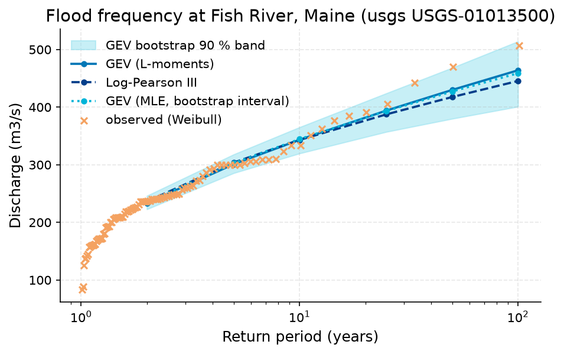
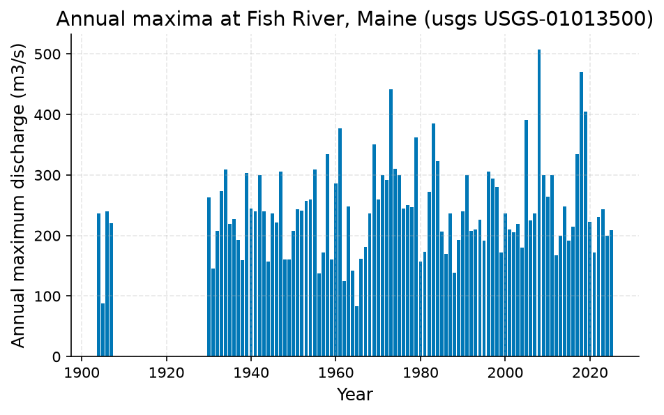
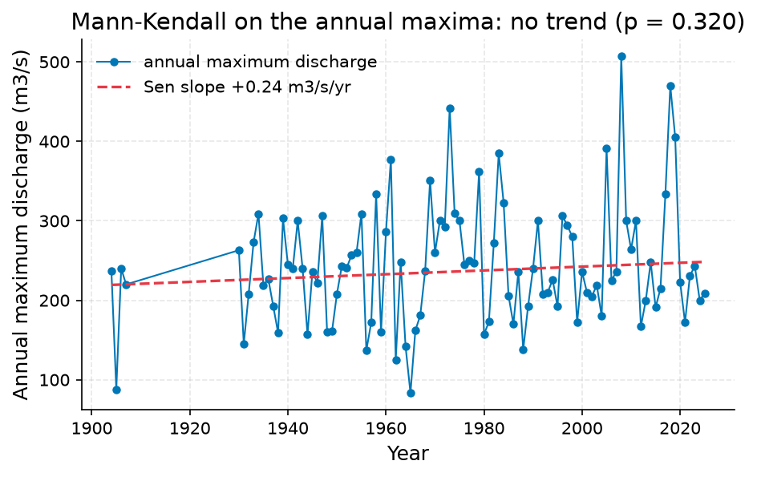

# Screen the 100-year daily-mean flood at Fish River, Maine; identify estimator un (47.2375, -68.5827777777778)

**Author:** AquaScope Studio  
**Date:** 2026-09-23  
**Description:** Screen the 100-year daily-mean flood at Fish River, Maine; identify estimator uncertainty and limitations.  
**Version:** 1.0  

**Site:** 47.2375 N, 68.5828 W

**Answer.** Screen the 100-year daily-mean flood at Fish River, Maine; identify estimator uncertainty and limitations: 100-year return level, GEV (L-moments) 463.9 m3/s (established). The 100-year return level from 100 annual maxima: GEV by L-moments 463.9 m3/s; Log-Pearson III 445.4 m3/s (90 % confidence interval 404.7 to 490.2 m3/s); bootstrap GEV 458.8 m3/s (90 % confidence interval 400.9 to 514.1 m3/s). Mann-Kendall on the annual maxima: not significant at the 5 % level (p = 0.32, Sen's slope 0.24 m3/s per year over 100 years). The record at Fish River, Maine (usgs USGS-01013500) runs from 1903-07-29 to 2026-09-21 (123.1 years, discharge in m3/s). The two fits differ by 4%.

*Key numbers*

| Quantity | Value | Unit | Step |
| --- | --- | --- | --- |
| Record length | 123.1 | years | s1 |
| 100-year return level, GEV (L-moments) | 463.9 | m3/s | s1 |
| 100-year return level, Log-Pearson III | 445.4 | m3/s | s1 |
| 100-year LP3 90 % interval, low | 404.7 | m3/s | s1 |
| 100-year LP3 90 % interval, high | 490.2 | m3/s | s1 |
| 100-year return level, GEV (MLE with L-moments fallback) | 458.8 | m3/s | s1 |
| 100-year GEV bootstrap 90 % interval, low | 400.9 | m3/s | s1 |
| 100-year GEV bootstrap 90 % interval, high | 514.1 | m3/s | s1 |
| Q95 (exceeded 95 % of days) | 4.67 | m3/s | s1 |
| Q50 (median flow) | 21.9 | m3/s | s1 |
| Q10 | 101.0 | m3/s | s1 |
| Mann-Kendall p-value (annual maxima) | 0.3197 |  | s1 |
| Sen's slope | 0.24 | m3/s per year | s1 |
| 2-year return level, GEV (L-moments) | 233.4 | m3/s | s1 |
| 2-year return level, Log-Pearson III | 236.3 | m3/s | s1 |
| 5-year return level, GEV (L-moments) | 301.0 | m3/s | s1 |
| 5-year return level, Log-Pearson III | 303.9 | m3/s | s1 |
| 10-year return level, GEV (L-moments) | 343.3 | m3/s | s1 |
| 10-year return level, Log-Pearson III | 343.1 | m3/s | s1 |
| 25-year return level, GEV (L-moments) | 394.1 | m3/s | s1 |
| 25-year return level, Log-Pearson III | 387.5 | m3/s | s1 |
| 50-year return level, GEV (L-moments) | 429.9 | m3/s | s1 |
| 50-year return level, Log-Pearson III | 417.6 | m3/s | s1 |

## Summary

Screen the 100-year daily-mean flood at Fish River, Maine; identify estimator uncertainty and limitations.. The record: Fish River, Maine (usgs USGS-01013500), 123.1 years. 1 step(s) ran (None plan, playbook flood_risk); 5 of 5 gates passed. Screen the 100-year daily-mean flood at Fish River, Maine; identify estimator uncertainty and limitations: 100-year return level, GEV (L-moments) 463.9 m3/s (established).

## The decision

Screen the 100-year daily-mean flood at Fish River, Maine; identify estimator uncertainty and limitations: 100-year return level, GEV (L-moments) 463.9 m3/s (established). It holds under these conditions: The annual maxima are independent and drawn from a stationary distribution.; Daily mean maxima can understate instantaneous flood peaks.. Limitations and unresolved checks: Maintainer reproduction; independent hydrologist review pending.; Daily mean maxima are not instantaneous annual peaks or a certified design flood.. The grade applies to primary result and applicable supporting checks.

## Findings

- [established] Record length: 123.1 years (from s1.years)
- [established] 100-year return level, GEV (L-moments): 463.9 m3/s (from s1.ffa.fits.gev_lmoments.q.5)
- [established] 100-year return level, Log-Pearson III: 445.4 m3/s (from s1.ffa.fits.lp3.q.5)
- [established] 100-year LP3 90 % interval, low: 404.7 m3/s (from s1.ffa.fits.lp3.ci.5.0)
- [established] 100-year LP3 90 % interval, high: 490.2 m3/s (from s1.ffa.fits.lp3.ci.5.1)
- [established] 100-year return level, GEV (MLE with L-moments fallback): 458.8 m3/s (from s1.ffa.fits.gev_bootstrap.q.5)
- [established] 100-year GEV bootstrap 90 % interval, low: 400.9 m3/s (from s1.ffa.fits.gev_bootstrap.ci.5.0)
- [established] 100-year GEV bootstrap 90 % interval, high: 514.1 m3/s (from s1.ffa.fits.gev_bootstrap.ci.5.1)
- [established] Q95 (exceeded 95 % of days): 4.67 m3/s (from s1.fdc.q95)
- [established] Q50 (median flow): 21.9 m3/s (from s1.fdc.exceedance.44)
- [established] Q10: 101 m3/s (from s1.fdc.q10)
- [established] Mann-Kendall p-value (annual maxima): 0.3197 (from s1.ffa.amax_trend.p_value)
- [established] Sen's slope: 0.24 m3/s per year (from s1.ffa.amax_trend.sens_slope_per_year)
- [established] 2-year return level, GEV (L-moments): 233.4 m3/s (from s1.ffa.fits.gev_lmoments.q.0)
- [established] 2-year return level, Log-Pearson III: 236.3 m3/s (from s1.ffa.fits.lp3.q.0)
- [established] 5-year return level, GEV (L-moments): 301 m3/s (from s1.ffa.fits.gev_lmoments.q.1)
- [established] 5-year return level, Log-Pearson III: 303.9 m3/s (from s1.ffa.fits.lp3.q.1)
- [established] 10-year return level, GEV (L-moments): 343.3 m3/s (from s1.ffa.fits.gev_lmoments.q.2)
- [established] 10-year return level, Log-Pearson III: 343.1 m3/s (from s1.ffa.fits.lp3.q.2)
- [established] 25-year return level, GEV (L-moments): 394.1 m3/s (from s1.ffa.fits.gev_lmoments.q.3)
- [established] 25-year return level, Log-Pearson III: 387.5 m3/s (from s1.ffa.fits.lp3.q.3)
- [established] 50-year return level, GEV (L-moments): 429.9 m3/s (from s1.ffa.fits.gev_lmoments.q.4)
- [established] 50-year return level, Log-Pearson III: 417.6 m3/s (from s1.ffa.fits.lp3.q.4)
- Agrees: spread 4% between 463.9, 445.4 (25% allowed) at T = 100 years
- Agrees: Mann-Kendall on the annual maxima: p = 0.32, tau = 0.07: no trend at the 0.05 level

## Problem and decision

Screen the 100-year daily-mean flood at Fish River, Maine; identify estimator uncertainty and limitations. Decision: Screen the 100-year daily-mean flood at Fish River, Maine; identify estimator uncertainty and limitations.. Intake: return_period = 100.

## Site and data

Site: 47.2375, -68.5827777777778. No inventory.

## Methodology

Objective: Screen the 100-year daily-mean flood at Fish River, Maine; identify estimator uncertainty and limitations..

1. Compare GEV L-moments, LP3 and GEV MLE quantiles on complete-year daily maxima.

Step s1: `flood_frequency(source='usgs', station_id='USGS-01013500', bootstrap_ci=True)`, method at_site_flood_frequency; gates: min_years 20 on ffa.n_years; unit_present on unit; max_return_period_factor 3 on ffa.n_years; spread_within 0.25 on ffa.fits.gev_lmoments.q, ffa.fits.lp3.q; trend_on_series 0.05 on ffa.amax_trend.

Assumptions: Independent stationary annual maxima..

## Results: step s1

The record at Fish River, Maine (usgs USGS-01013500) runs from 1903-07-29 to 2026-09-21 (123.1 years, discharge in m3/s). Mann-Kendall on the annual maxima: not significant at the 5 % level (p = 0.32, Sen's slope 0.24 m3/s per year over 100 years). The 100-year return level from 100 annual maxima: GEV by L-moments 463.9 m3/s; Log-Pearson III 445.4 m3/s (90 % confidence interval 404.7 to 490.2 m3/s); bootstrap GEV 458.8 m3/s (90 % confidence interval 400.9 to 514.1 m3/s). The two fits differ by 4%. Flow duration: the flow exceeded on 95 % of days is 4.67 m3/s, the median 21.9 m3/s, the flow exceeded on 10 % of days 101 m3/s. Gates: min_years passed (100 years of record, 20 needed); unit_present passed (unit m3/s); max_return_period_factor passed (T = 100 years against a cap of about 300 years (3 times 100 years of record)); spread_within passed (spread 4% between 463.9, 445.4 (25% allowed) at T = 100 years); trend_on_series passed (Mann-Kendall on the annual maxima: p = 0.32, tau = 0.07: no trend at the 0.05 level).


*Return levels of annual maximum discharge at Fish River, Maine (usgs USGS-01013500): GEV (L-moments), Log-Pearson III, GEV (MLE, bootstrap interval) fits with the GEV bootstrap 90 % band, and the observed annual maxima at their Weibull plotting positions.*


*Annual maximum discharge at Fish River, Maine (usgs USGS-01013500), 100 years (1904 to 2025).*


*Annual maximum discharge at Fish River, Maine (usgs USGS-01013500) with the Sen slope line; the Mann-Kendall test on the annual maxima finds no trend (p = 0.320, 100 years).*

*Return levels at Fish River, Maine (usgs USGS-01013500) by return period, with the confidence band.*

| T | GEV | LP3 | lower | upper |
| --- | --- | --- | --- | --- |
| 2.0 | 233.3828 | 236.3042 | 222.7553 | 246.047 |
| 5.0 | 301.044 | 303.8977 | 285.5962 | 317.9906 |
| 10.0 | 343.338 | 343.0796 | 319.6619 | 365.1152 |
| 25.0 | 394.0839 | 387.5232 | 357.1478 | 424.0718 |
| 50.0 | 429.8805 | 417.5643 | 379.8743 | 468.2861 |
| 100.0 | 463.9272 | 445.3895 | 400.8806 | 514.057 |

*Annual maxima at Fish River, Maine (usgs USGS-01013500).*

| year | value |
| --- | --- |
| 1904 | 237.0 |
| 1905 | 88.0 |
| 1906 | 240.0 |
| 1907 | 220.0 |
| 1930 | 263.0 |
| 1931 | 145.0 |
| 1932 | 208.0 |
| 1933 | 273.0 |
| 1934 | 309.0 |
| 1935 | 219.0 |
| 1936 | 227.0 |
| 1937 | 193.0 |
| 1938 | 159.0 |
| 1939 | 303.0 |
| 1940 | 245.0 |
| 1941 | 240.0 |
| 1942 | 300.0 |
| 1943 | 240.0 |
| 1944 | 157.0 |
| 1945 | 236.0 |
| 1946 | 222.0 |
| 1947 | 306.0 |
| 1948 | 160.0 |
| 1949 | 161.0 |
| 1950 | 208.0 |
| 1951 | 243.0 |
| 1952 | 241.0 |
| 1953 | 257.0 |
| 1954 | 260.0 |
| 1955 | 309.0 |
| 1956 | 137.0 |
| 1957 | 172.0 |
| 1958 | 334.0 |
| 1959 | 160.0 |
| 1960 | 286.0 |
| 1961 | 377.0 |
| 1962 | 125.0 |
| 1963 | 248.0 |
| 1964 | 142.0 |
| 1965 | 83.3 |
| 1966 | 162.0 |
| 1967 | 181.0 |
| 1968 | 237.0 |
| 1969 | 351.0 |
| 1970 | 260.0 |
| 1971 | 300.0 |
| 1972 | 292.0 |
| 1973 | 442.0 |
| 1974 | 310.0 |
| 1975 | 300.0 |

*Spread between the GEV and Log-Pearson III return levels at Fish River, Maine (usgs USGS-01013500).*

| T | GEV | LP3 | spread_pct |
| --- | --- | --- | --- |
| 2.0 | 233.3828 | 236.3042 | 1.2 |
| 5.0 | 301.044 | 303.8977 | 0.9 |
| 10.0 | 343.338 | 343.0796 | 0.1 |
| 25.0 | 394.0839 | 387.5232 | 1.7 |
| 50.0 | 429.8805 | 417.5643 | 2.9 |
| 100.0 | 463.9272 | 445.3895 | 4.1 |

## Limitations and what this study does not establish

Every gate and check passed.

Caveats, verbatim from the playbook:
- Maintainer reproduction; independent hydrologist review pending.
- Daily mean maxima are not instantaneous annual peaks or a certified design flood.
- No catchment regulation, channel topology or model/gauge comparability was established.
- Re-run live uses current observations; use the retained CSV and this script for reproduction.

## Caveats

- Maintainer reproduction; independent hydrologist review pending.
- Daily mean maxima are not instantaneous annual peaks or a certified design flood.
- No catchment regulation, channel topology or model/gauge comparability was established.
- Re-run live uses current observations; use the retained CSV and this script for reproduction.

## Recommendations

- Adopt this as the answer to the decision: Screen the 100-year daily-mean flood at Fish River, Maine; identify estimator uncertainty and limitations: 100-year return level, GEV (L-moments) 463.9 m3/s (established).
- Quote both fits with their intervals: spread 4% between 463.9, 445.4 (25% allowed) at T = 100 years.
- Read the numbers with this caveat: Maintainer reproduction; independent hydrologist review pending.
- Read the numbers with this caveat: Daily mean maxima are not instantaneous annual peaks or a certified design flood.
- Read the numbers with this caveat: No catchment regulation, channel topology or model/gauge comparability was established.

## References

1. England et al. (2019) Bulletin 17C
2. Hosking, J. R. M. (1990). L-moments: analysis and estimation of distributions using linear combinations of order statistics. J. R. Stat. Soc. B, 52(1), 105-124.
3. Vogel, R. M., & Fennessey, N. M. (1994). Flow-duration curves I: new interpretation and confidence intervals. J. Water Resour. Plann. Manage., 120(4), 485-504.
4. England, J. F. Jr. et al. (2018). Guidelines for determining flood flow frequency, Bulletin 17C. USGS Techniques and Methods 4-B5.
5. Mann, H. B. (1945). Nonparametric tests against trend. Econometrica, 13, 245-259
6. Sen, P. K. (1968). J. Am. Stat. Assoc., 63, 1379-1389.
7. Rekin226 and contributors. AquaScope Hydrology 0.18.0 [Software]. Release DOI: https://doi.org/10.5281/zenodo.22787700. All versions: https://doi.org/10.5281/zenodo.21903143. Analysis software revision: efe3a0e9f8469011f2f6ad9a8c87967dbf22072a; the release DOI does not archive later code changes.

## Appendix: reproducibility

Re-run the same steps with no model: `aquascope run study.yaml`. Resume the workspace: `aquascope studio --resume workspace.json`.

Model: none via none; ledger: no model calls. aquascope 0.18.0.

```yaml
# An AquaScope study (version 3): the plan behind an answer, its gates, and what happened.
#   aquascope run study.yaml
version: 3
title: "Daily-mean flood screening: Fish River, Maine"
question: "Screen the 100-year daily-mean flood at Fish River, Maine; identify estimator uncertainty and limitations."
created: "2026-09-23T03:42:54+00:00"
aquascope_version: "0.18.0"
author: "hand"
problem:
  kind: "flood_risk"
  site: {"lat": 47.2375, "lon": -68.5827777777778}
  params: {"return_period": 100}
plan:
  playbook: "flood_risk"
  objective: "Screen the 100-year daily-mean flood at Fish River, Maine; identify estimator uncertainty and limitations."
  caveats: ["Maintainer reproduction; independent hydrologist review pending.", "Daily mean maxima are not instantaneous annual peaks or a certified design flood.", "No catchment regulation, channel topology or model/gauge comparability was established.", "Re-run live uses current observations; use the retained CSV and this script for reproduction."]
  methodology: ["Compare GEV L-moments, LP3 and GEV MLE quantiles on complete-year daily maxima."]
  assumptions: ["Independent stationary annual maxima."]
steps:
  - tool: "flood_frequency"
    id: "s1"
    method: "at_site_flood_frequency"
    arguments:
      source: "usgs"
      station_id: "USGS-01013500"
      bootstrap_ci: true
    expects:
      - {"check": "min_years", "path": "ffa.n_years", "value": 20}
      - {"check": "unit_present", "path": "unit"}
      - {"check": "max_return_period_factor", "path": "ffa.n_years", "value": 3, "return_period": 100}
      - {"check": "spread_within", "paths": ["ffa.fits.gev_lmoments.q", "ffa.fits.lp3.q"], "value": 0.25, "return_period": 100}
      - {"check": "trend_on_series", "path": "ffa.amax_trend", "value": 0.05}
results:
  s1: {"ok": true, "gates": [{"check": "min_years", "passed": true, "detail": "100 years of record, 20 needed"}, {"check": "unit_present", "passed": true, "detail": "unit m3/s"}, {"check": "max_return_period_factor", "passed": true, "detail": "T = 100 years against a cap of about 300 years (3 times 100 years of record)"}, {"check": "spread_within", "passed": true, "detail": "spread 4% between 463.9, 445.4 (25% allowed) at T = 100 years"}, {"check": "trend_on_series", "passed": true, "detail": "Mann-Kendall on the annual maxima: p = 0.32, tau = 0.07: no trend at the 0.05 level"}], "summary": "source=usgs, station_id=USGS-01013500, variable=discharge, unit=m3/s, years=123.1, start=1903-07-29, end=2026-09-21", "fallback_used": false, "sha256": "7f69289cfe4c5c6a"}
```

Result identities (also in findings.json and the Findings worksheet):
- 100-year return level, GEV (L-moments): result s1.ffa.fits.gev_lmoments.q.5; estimator gev_lmoments; annual maxima of daily mean discharge; years with at least 292 observed days. Input usgs/USGS-01013500, discharge, m3/s, 1903-07-29 to 2026-09-21; content sha256:735990f72ac655a5dbd68aae19e42a769abbcf9eb95747702bb582f7ff4d642c. Software 0.18.0; revision efe3a0e9f8469011f2f6ad9a8c87967dbf22072a. Archive revision not recorded; content hash is not an archive DOI. No interval for this estimator.
- 100-year return level, Log-Pearson III: result s1.ffa.fits.lp3.q.5; estimator lp3_log_moments; annual maxima of daily mean discharge; years with at least 292 observed days. Input usgs/USGS-01013500, discharge, m3/s, 1903-07-29 to 2026-09-21; content sha256:735990f72ac655a5dbd68aae19e42a769abbcf9eb95747702bb582f7ff4d642c. Software 0.18.0; revision efe3a0e9f8469011f2f6ad9a8c87967dbf22072a. Archive revision not recorded; content hash is not an archive DOI. Own interval [404.6771, 490.1978], method variance_of_estimate, level 0.9.
- 100-year return level, GEV (MLE with L-moments fallback): result s1.ffa.fits.gev_bootstrap.q.5; estimator gev_mle_with_lmoments_fallback; annual maxima of daily mean discharge; years with at least 292 observed days. Input usgs/USGS-01013500, discharge, m3/s, 1903-07-29 to 2026-09-21; content sha256:735990f72ac655a5dbd68aae19e42a769abbcf9eb95747702bb582f7ff4d642c. Software 0.18.0; revision efe3a0e9f8469011f2f6ad9a8c87967dbf22072a. Archive revision not recorded; content hash is not an archive DOI. Own interval [400.8806, 514.057], method nonparametric_bootstrap_percentile, level 0.9.
- 2-year return level, GEV (L-moments): result s1.ffa.fits.gev_lmoments.q.0; estimator gev_lmoments; annual maxima of daily mean discharge; years with at least 292 observed days. Input usgs/USGS-01013500, discharge, m3/s, 1903-07-29 to 2026-09-21; content sha256:735990f72ac655a5dbd68aae19e42a769abbcf9eb95747702bb582f7ff4d642c. Software 0.18.0; revision efe3a0e9f8469011f2f6ad9a8c87967dbf22072a. Archive revision not recorded; content hash is not an archive DOI. No interval for this estimator.
- 2-year return level, Log-Pearson III: result s1.ffa.fits.lp3.q.0; estimator lp3_log_moments; annual maxima of daily mean discharge; years with at least 292 observed days. Input usgs/USGS-01013500, discharge, m3/s, 1903-07-29 to 2026-09-21; content sha256:735990f72ac655a5dbd68aae19e42a769abbcf9eb95747702bb582f7ff4d642c. Software 0.18.0; revision efe3a0e9f8469011f2f6ad9a8c87967dbf22072a. Archive revision not recorded; content hash is not an archive DOI. Own interval [224.1971, 249.0651], method variance_of_estimate, level 0.9.
- 5-year return level, GEV (L-moments): result s1.ffa.fits.gev_lmoments.q.1; estimator gev_lmoments; annual maxima of daily mean discharge; years with at least 292 observed days. Input usgs/USGS-01013500, discharge, m3/s, 1903-07-29 to 2026-09-21; content sha256:735990f72ac655a5dbd68aae19e42a769abbcf9eb95747702bb582f7ff4d642c. Software 0.18.0; revision efe3a0e9f8469011f2f6ad9a8c87967dbf22072a. Archive revision not recorded; content hash is not an archive DOI. No interval for this estimator.
- 5-year return level, Log-Pearson III: result s1.ffa.fits.lp3.q.1; estimator lp3_log_moments; annual maxima of daily mean discharge; years with at least 292 observed days. Input usgs/USGS-01013500, discharge, m3/s, 1903-07-29 to 2026-09-21; content sha256:735990f72ac655a5dbd68aae19e42a769abbcf9eb95747702bb582f7ff4d642c. Software 0.18.0; revision efe3a0e9f8469011f2f6ad9a8c87967dbf22072a. Archive revision not recorded; content hash is not an archive DOI. Own interval [285.5826, 323.3874], method variance_of_estimate, level 0.9.
- 10-year return level, GEV (L-moments): result s1.ffa.fits.gev_lmoments.q.2; estimator gev_lmoments; annual maxima of daily mean discharge; years with at least 292 observed days. Input usgs/USGS-01013500, discharge, m3/s, 1903-07-29 to 2026-09-21; content sha256:735990f72ac655a5dbd68aae19e42a769abbcf9eb95747702bb582f7ff4d642c. Software 0.18.0; revision efe3a0e9f8469011f2f6ad9a8c87967dbf22072a. Archive revision not recorded; content hash is not an archive DOI. No interval for this estimator.
- 10-year return level, Log-Pearson III: result s1.ffa.fits.lp3.q.2; estimator lp3_log_moments; annual maxima of daily mean discharge; years with at least 292 observed days. Input usgs/USGS-01013500, discharge, m3/s, 1903-07-29 to 2026-09-21; content sha256:735990f72ac655a5dbd68aae19e42a769abbcf9eb95747702bb582f7ff4d642c. Software 0.18.0; revision efe3a0e9f8469011f2f6ad9a8c87967dbf22072a. Archive revision not recorded; content hash is not an archive DOI. Own interval [319.488, 368.4132], method variance_of_estimate, level 0.9.
- 25-year return level, GEV (L-moments): result s1.ffa.fits.gev_lmoments.q.3; estimator gev_lmoments; annual maxima of daily mean discharge; years with at least 292 observed days. Input usgs/USGS-01013500, discharge, m3/s, 1903-07-29 to 2026-09-21; content sha256:735990f72ac655a5dbd68aae19e42a769abbcf9eb95747702bb582f7ff4d642c. Software 0.18.0; revision efe3a0e9f8469011f2f6ad9a8c87967dbf22072a. Archive revision not recorded; content hash is not an archive DOI. No interval for this estimator.
- 25-year return level, Log-Pearson III: result s1.ffa.fits.lp3.q.3; estimator lp3_log_moments; annual maxima of daily mean discharge; years with at least 292 observed days. Input usgs/USGS-01013500, discharge, m3/s, 1903-07-29 to 2026-09-21; content sha256:735990f72ac655a5dbd68aae19e42a769abbcf9eb95747702bb582f7ff4d642c. Software 0.18.0; revision efe3a0e9f8469011f2f6ad9a8c87967dbf22072a. Archive revision not recorded; content hash is not an archive DOI. Own interval [356.9803, 420.6793], method variance_of_estimate, level 0.9.
- 50-year return level, GEV (L-moments): result s1.ffa.fits.gev_lmoments.q.4; estimator gev_lmoments; annual maxima of daily mean discharge; years with at least 292 observed days. Input usgs/USGS-01013500, discharge, m3/s, 1903-07-29 to 2026-09-21; content sha256:735990f72ac655a5dbd68aae19e42a769abbcf9eb95747702bb582f7ff4d642c. Software 0.18.0; revision efe3a0e9f8469011f2f6ad9a8c87967dbf22072a. Archive revision not recorded; content hash is not an archive DOI. No interval for this estimator.
- 50-year return level, Log-Pearson III: result s1.ffa.fits.lp3.q.4; estimator lp3_log_moments; annual maxima of daily mean discharge; years with at least 292 observed days. Input usgs/USGS-01013500, discharge, m3/s, 1903-07-29 to 2026-09-21; content sha256:735990f72ac655a5dbd68aae19e42a769abbcf9eb95747702bb582f7ff4d642c. Software 0.18.0; revision efe3a0e9f8469011f2f6ad9a8c87967dbf22072a. Archive revision not recorded; content hash is not an archive DOI. Own interval [381.8784, 456.585], method variance_of_estimate, level 0.9.

## Cite this software

Rekin226 and contributors. AquaScope Hydrology 0.18.0 [Software]. Release DOI: https://doi.org/10.5281/zenodo.22787700. All versions: https://doi.org/10.5281/zenodo.21903143. Analysis software revision: efe3a0e9f8469011f2f6ad9a8c87967dbf22072a; the release DOI does not archive later code changes.


---

*{'model': None, 'provider': None, 'prose': 'template', 'tokens': {}, 'total_tokens': 0, 'total_usd': None, 'budget': None, 'dropped': 0, 'aquascope_version': '0.18.0', 'date': '2026-09-23 03:42 UTC', 'workspace': '453cb36f380a', 'plan_author': 'hand', 'written_by': {'answer': 'template', 'summary': 'template', 'decision': 'template', 'findings': 'template', 'problem': 'template', 'site_data': 'template', 'methodology': 'template', 'results-s1': 'template', 'limitations': 'template', 'recommendations': 'template', 'references': 'template', 'appendix': 'template'}}*
