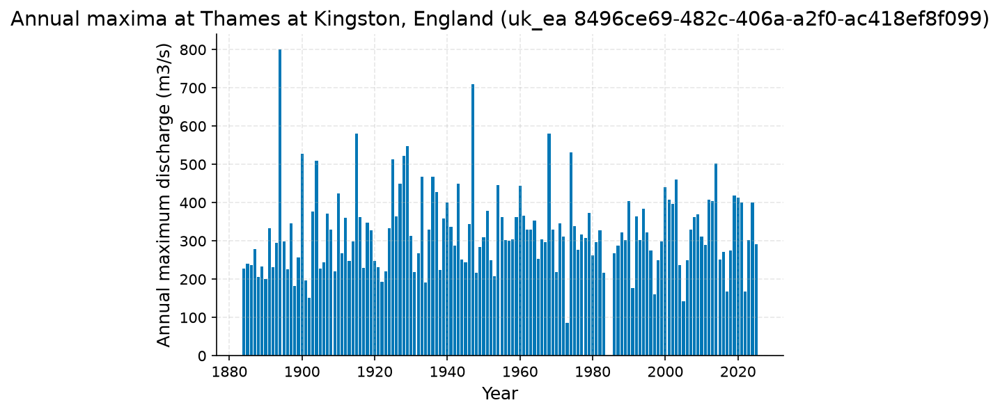
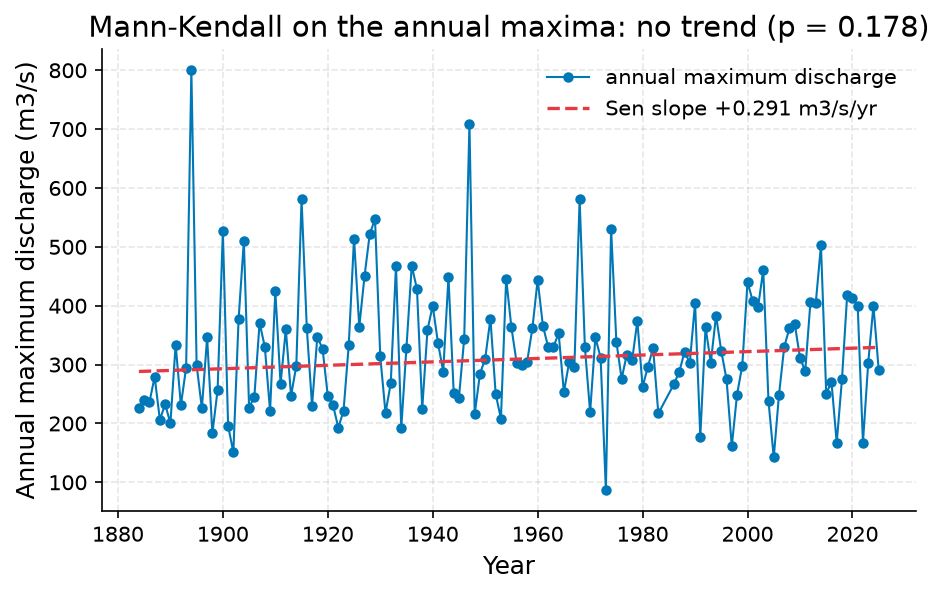

# Screen the 100-year daily-mean flood at Thames at Kingston, England; identify es (51.415482, -0.307629)

**Author:** AquaScope Studio  
**Date:** 2026-09-23  
**Description:** Screen the 100-year daily-mean flood at Thames at Kingston, England; identify estimator uncertainty and limitations.  
**Version:** 1.0  

**Site:** 51.4155 N, 0.3076 W

**Answer.** Screen the 100-year daily-mean flood at Thames at Kingston, England; identify estimator uncertainty and limitations: 100-year return level, GEV (L-moments) 652.5 m3/s (established). The 100-year return level from 140 annual maxima: GEV by L-moments 652.5 m3/s; Log-Pearson III 624 m3/s (90 % confidence interval 573.2 to 679.4 m3/s); bootstrap GEV 646.2 m3/s (90 % confidence interval 565.4 to 723.1 m3/s). Mann-Kendall on the annual maxima: not significant at the 5 % level (p = 0.178, Sen's slope 0.2906 m3/s per year over 140 years). The record at Thames at Kingston, England (uk_ea 8496ce69-482c-406a-a2f0-ac418ef8f099) runs from 1883-10-01 to 2026-09-09 (142.9 years, discharge in m3/s). The two fits differ by 4%.

*Key numbers*

| Quantity | Value | Unit | Step |
| --- | --- | --- | --- |
| Record length | 142.9 | years | s1 |
| 100-year return level, GEV (L-moments) | 652.5 | m3/s | s1 |
| 100-year return level, Log-Pearson III | 624.0 | m3/s | s1 |
| 100-year LP3 90 % interval, low | 573.2 | m3/s | s1 |
| 100-year LP3 90 % interval, high | 679.4 | m3/s | s1 |
| 100-year return level, GEV (MLE with L-moments fallback) | 646.2 | m3/s | s1 |
| 100-year GEV bootstrap 90 % interval, low | 565.4 | m3/s | s1 |
| 100-year GEV bootstrap 90 % interval, high | 723.1 | m3/s | s1 |
| Q95 (exceeded 95 % of days) | 7.52 | m3/s | s1 |
| Q50 (median flow) | 39.9 | m3/s | s1 |
| Q10 | 162.0 | m3/s | s1 |
| Mann-Kendall p-value (annual maxima) | 0.1784 |  | s1 |
| Sen's slope | 0.2906 | m3/s per year | s1 |
| 2-year return level, GEV (L-moments) | 307.9 | m3/s | s1 |
| 2-year return level, Log-Pearson III | 311.8 | m3/s | s1 |
| 5-year return level, GEV (L-moments) | 403.0 | m3/s | s1 |
| 5-year return level, Log-Pearson III | 407.1 | m3/s | s1 |
| 10-year return level, GEV (L-moments) | 464.8 | m3/s | s1 |
| 10-year return level, Log-Pearson III | 464.7 | m3/s | s1 |
| 25-year return level, GEV (L-moments) | 541.6 | m3/s | s1 |
| 25-year return level, Log-Pearson III | 532.2 | m3/s | s1 |
| 50-year return level, GEV (L-moments) | 597.6 | m3/s | s1 |
| 50-year return level, Log-Pearson III | 579.3 | m3/s | s1 |

## Summary

Screen the 100-year daily-mean flood at Thames at Kingston, England; identify estimator uncertainty and limitations.. The record: Thames at Kingston, England (uk_ea 8496ce69-482c-406a-a2f0-ac418ef8f099), 142.9 years. 1 step(s) ran (None plan, playbook flood_risk); 5 of 5 gates passed. Screen the 100-year daily-mean flood at Thames at Kingston, England; identify estimator uncertainty and limitations: 100-year return level, GEV (L-moments) 652.5 m3/s (established).

## The decision

Screen the 100-year daily-mean flood at Thames at Kingston, England; identify estimator uncertainty and limitations: 100-year return level, GEV (L-moments) 652.5 m3/s (established). It holds under these conditions: The annual maxima are independent and drawn from a stationary distribution.; Daily mean maxima can understate instantaneous flood peaks.. Limitations and unresolved checks: Maintainer reproduction; independent hydrologist review pending.; Daily mean maxima are not instantaneous annual peaks or a certified design flood.. The grade applies to primary result and applicable supporting checks.

## Findings

- [established] Record length: 142.9 years (from s1.years)
- [established] 100-year return level, GEV (L-moments): 652.5 m3/s (from s1.ffa.fits.gev_lmoments.q.5)
- [established] 100-year return level, Log-Pearson III: 624 m3/s (from s1.ffa.fits.lp3.q.5)
- [established] 100-year LP3 90 % interval, low: 573.2 m3/s (from s1.ffa.fits.lp3.ci.3.1)
- [established] 100-year LP3 90 % interval, high: 679.4 m3/s (from s1.ffa.fits.gev_lmoments.at_record_max)
- [established] 100-year return level, GEV (MLE with L-moments fallback): 646.2 m3/s (from s1.ffa.fits.gev_bootstrap.q.5)
- [established] 100-year GEV bootstrap 90 % interval, low: 565.4 m3/s (from s1.ffa.fits.gev_bootstrap.ci.5.0)
- [established] 100-year GEV bootstrap 90 % interval, high: 723.1 m3/s (from s1.ffa.fits.gev_bootstrap.ci.5.1)
- [established] Q95 (exceeded 95 % of days): 7.52 m3/s (from s1.fdc.q95)
- [established] Q50 (median flow): 39.9 m3/s (from s1.fdc.q50)
- [established] Q10: 162 m3/s (from s1.fdc.q.20)
- [established] Mann-Kendall p-value (annual maxima): 0.1784 (from s1.ffa.amax_trend.p_value)
- [established] Sen's slope: 0.2906 m3/s per year (from s1.ffa.amax_trend.sens_slope_per_year)
- [established] 2-year return level, GEV (L-moments): 307.9 m3/s (from s1.ffa.fits.gev_lmoments.q.0)
- [established] 2-year return level, Log-Pearson III: 311.8 m3/s (from s1.ffa.fits.lp3.q.0)
- [established] 5-year return level, GEV (L-moments): 403 m3/s (from s1.ffa.fits.gev_lmoments.q.1)
- [established] 5-year return level, Log-Pearson III: 407.1 m3/s (from s1.ffa.fits.lp3.q.1)
- [established] 10-year return level, GEV (L-moments): 464.8 m3/s (from s1.ffa.fits.gev_lmoments.q.2)
- [established] 10-year return level, Log-Pearson III: 464.7 m3/s (from s1.ffa.fits.lp3.q.2)
- [established] 25-year return level, GEV (L-moments): 541.6 m3/s (from s1.ffa.fits.gev_lmoments.q.3)
- [established] 25-year return level, Log-Pearson III: 532.2 m3/s (from s1.ffa.fits.lp3.q.3)
- [established] 50-year return level, GEV (L-moments): 597.6 m3/s (from s1.ffa.fits.gev_lmoments.q.4)
- [established] 50-year return level, Log-Pearson III: 579.3 m3/s (from s1.ffa.fits.lp3.q.4)
- Agrees: spread 4% between 652.5, 624 (25% allowed) at T = 100 years
- Agrees: Mann-Kendall on the annual maxima: p = 0.178, tau = 0.08: no trend at the 0.05 level

## Problem and decision

Screen the 100-year daily-mean flood at Thames at Kingston, England; identify estimator uncertainty and limitations. Decision: Screen the 100-year daily-mean flood at Thames at Kingston, England; identify estimator uncertainty and limitations.. Intake: return_period = 100.

## Site and data

Site: 51.415482, -0.307629. No inventory.

## Methodology

Objective: Screen the 100-year daily-mean flood at Thames at Kingston, England; identify estimator uncertainty and limitations..

1. Compare GEV L-moments, LP3 and GEV MLE quantiles on complete-year daily maxima.

Step s1: `flood_frequency(source='uk_ea', station_id='8496ce69-482c-406a-a2f0-ac418ef8f099', bootstrap_ci=True)`, method at_site_flood_frequency; gates: min_years 20 on ffa.n_years; unit_present on unit; max_return_period_factor 3 on ffa.n_years; spread_within 0.25 on ffa.fits.gev_lmoments.q, ffa.fits.lp3.q; trend_on_series 0.05 on ffa.amax_trend.

Assumptions: Independent stationary annual maxima..

## Results: step s1

The record at Thames at Kingston, England (uk_ea 8496ce69-482c-406a-a2f0-ac418ef8f099) runs from 1883-10-01 to 2026-09-09 (142.9 years, discharge in m3/s). Mann-Kendall on the annual maxima: not significant at the 5 % level (p = 0.178, Sen's slope 0.2906 m3/s per year over 140 years). The 100-year return level from 140 annual maxima: GEV by L-moments 652.5 m3/s; Log-Pearson III 624 m3/s (90 % confidence interval 573.2 to 679.4 m3/s); bootstrap GEV 646.2 m3/s (90 % confidence interval 565.4 to 723.1 m3/s). The two fits differ by 4%. Flow duration: the flow exceeded on 95 % of days is 7.52 m3/s, the median 39.9 m3/s, the flow exceeded on 10 % of days 162 m3/s. Gates: min_years passed (140 years of record, 20 needed); unit_present passed (unit m3/s); max_return_period_factor passed (T = 100 years against a cap of about 420 years (3 times 140 years of record)); spread_within passed (spread 4% between 652.5, 624 (25% allowed) at T = 100 years); trend_on_series passed (Mann-Kendall on the annual maxima: p = 0.178, tau = 0.08: no trend at the 0.05 level).


*Return levels of annual maximum discharge at Thames at Kingston, England (uk_ea 8496ce69-482c-406a-a2f0-ac418ef8f099): GEV (L-moments), Log-Pearson III, GEV (MLE, bootstrap interval) fits with the GEV bootstrap 90 % band, and the observed annual maxima at their Weibull plotting positions.*


*Annual maximum discharge at Thames at Kingston, England (uk_ea 8496ce69-482c-406a-a2f0-ac418ef8f099), 140 years (1884 to 2025).*


*Annual maximum discharge at Thames at Kingston, England (uk_ea 8496ce69-482c-406a-a2f0-ac418ef8f099) with the Sen slope line; the Mann-Kendall test on the annual maxima finds no trend (p = 0.178, 140 years).*

*Return levels at Thames at Kingston, England (uk_ea 8496ce69-482c-406a-a2f0-ac418ef8f099) by return period, with the confidence band.*

| T | GEV | LP3 | lower | upper |
| --- | --- | --- | --- | --- |
| 2.0 | 307.917 | 311.75 | 295.1933 | 323.9715 |
| 5.0 | 403.0441 | 407.1086 | 383.2295 | 425.9326 |
| 10.0 | 464.8468 | 464.6854 | 436.5283 | 493.5379 |
| 25.0 | 541.616 | 532.2235 | 494.2591 | 582.3356 |
| 50.0 | 597.6318 | 579.3046 | 532.6547 | 651.8774 |
| 100.0 | 652.4577 | 624.0012 | 565.4195 | 723.1096 |

*Annual maxima at Thames at Kingston, England (uk_ea 8496ce69-482c-406a-a2f0-ac418ef8f099).*

| year | value |
| --- | --- |
| 1884 | 227.0 |
| 1885 | 240.0 |
| 1886 | 236.0 |
| 1887 | 279.0 |
| 1888 | 206.0 |
| 1889 | 233.0 |
| 1890 | 200.0 |
| 1891 | 334.0 |
| 1892 | 231.0 |
| 1893 | 295.0 |
| 1894 | 800.0 |
| 1895 | 299.0 |
| 1896 | 226.0 |
| 1897 | 346.0 |
| 1898 | 183.0 |
| 1899 | 257.0 |
| 1900 | 527.0 |
| 1901 | 196.0 |
| 1902 | 151.0 |
| 1903 | 377.0 |
| 1904 | 510.0 |
| 1905 | 227.0 |
| 1906 | 245.0 |
| 1907 | 371.0 |
| 1908 | 330.0 |
| 1909 | 221.0 |
| 1910 | 425.0 |
| 1911 | 267.0 |
| 1912 | 360.0 |
| 1913 | 247.0 |
| 1914 | 298.0 |
| 1915 | 581.0 |
| 1916 | 362.0 |
| 1917 | 230.0 |
| 1918 | 347.0 |
| 1919 | 327.0 |
| 1920 | 247.0 |
| 1921 | 231.0 |
| 1922 | 193.0 |
| 1923 | 221.0 |
| 1924 | 334.0 |
| 1925 | 514.0 |
| 1926 | 364.0 |
| 1927 | 450.0 |
| 1928 | 522.0 |
| 1929 | 547.0 |
| 1930 | 314.0 |
| 1931 | 218.0 |
| 1932 | 268.0 |
| 1933 | 468.0 |

*Spread between the GEV and Log-Pearson III return levels at Thames at Kingston, England (uk_ea 8496ce69-482c-406a-a2f0-ac418ef8f099).*

| T | GEV | LP3 | spread_pct |
| --- | --- | --- | --- |
| 2.0 | 307.917 | 311.75 | 1.2 |
| 5.0 | 403.0441 | 407.1086 | 1.0 |
| 10.0 | 464.8468 | 464.6854 | 0.0 |
| 25.0 | 541.616 | 532.2235 | 1.7 |
| 50.0 | 597.6318 | 579.3046 | 3.1 |
| 100.0 | 652.4577 | 624.0012 | 4.5 |

## Limitations and what this study does not establish

Every gate and check passed.

Caveats, verbatim from the playbook:
- Maintainer reproduction; independent hydrologist review pending.
- Daily mean maxima are not instantaneous annual peaks or a certified design flood.
- No catchment regulation, channel topology or model/gauge comparability was established.
- Re-run live uses current observations; use the retained CSV and this script for reproduction.

## Caveats

- Maintainer reproduction; independent hydrologist review pending.
- Daily mean maxima are not instantaneous annual peaks or a certified design flood.
- No catchment regulation, channel topology or model/gauge comparability was established.
- Re-run live uses current observations; use the retained CSV and this script for reproduction.

## Recommendations

- Adopt this as the answer to the decision: Screen the 100-year daily-mean flood at Thames at Kingston, England; identify estimator uncertainty and limitations: 100-year return level, GEV (L-moments) 652.5 m3/s (established).
- Quote both fits with their intervals: spread 4% between 652.5, 624 (25% allowed) at T = 100 years.
- Read the numbers with this caveat: Maintainer reproduction; independent hydrologist review pending.
- Read the numbers with this caveat: Daily mean maxima are not instantaneous annual peaks or a certified design flood.
- Read the numbers with this caveat: No catchment regulation, channel topology or model/gauge comparability was established.

## References

1. England et al. (2019) Bulletin 17C
2. Hosking, J. R. M. (1990). L-moments: analysis and estimation of distributions using linear combinations of order statistics. J. R. Stat. Soc. B, 52(1), 105-124.
3. Vogel, R. M., & Fennessey, N. M. (1994). Flow-duration curves I: new interpretation and confidence intervals. J. Water Resour. Plann. Manage., 120(4), 485-504.
4. England, J. F. Jr. et al. (2018). Guidelines for determining flood flow frequency, Bulletin 17C. USGS Techniques and Methods 4-B5.
5. Mann, H. B. (1945). Nonparametric tests against trend. Econometrica, 13, 245-259
6. Sen, P. K. (1968). J. Am. Stat. Assoc., 63, 1379-1389.
7. Rekin226 and contributors. AquaScope Hydrology 0.18.0 [Software]. Release DOI: https://doi.org/10.5281/zenodo.22787700. All versions: https://doi.org/10.5281/zenodo.21903143. Analysis software revision: efe3a0e9f8469011f2f6ad9a8c87967dbf22072a; the release DOI does not archive later code changes.

## Appendix: reproducibility

Re-run the same steps with no model: `aquascope run study.yaml`. Resume the workspace: `aquascope studio --resume workspace.json`.

Model: none via none; ledger: no model calls. aquascope 0.18.0.

```yaml
# An AquaScope study (version 3): the plan behind an answer, its gates, and what happened.
#   aquascope run study.yaml
version: 3
title: "Daily-mean flood screening: Thames at Kingston, England"
question: "Screen the 100-year daily-mean flood at Thames at Kingston, England; identify estimator uncertainty and limitations."
created: "2026-09-23T03:43:04+00:00"
aquascope_version: "0.18.0"
author: "hand"
problem:
  kind: "flood_risk"
  site: {"lat": 51.415482, "lon": -0.307629}
  params: {"return_period": 100}
plan:
  playbook: "flood_risk"
  objective: "Screen the 100-year daily-mean flood at Thames at Kingston, England; identify estimator uncertainty and limitations."
  caveats: ["Maintainer reproduction; independent hydrologist review pending.", "Daily mean maxima are not instantaneous annual peaks or a certified design flood.", "No catchment regulation, channel topology or model/gauge comparability was established.", "Re-run live uses current observations; use the retained CSV and this script for reproduction."]
  methodology: ["Compare GEV L-moments, LP3 and GEV MLE quantiles on complete-year daily maxima."]
  assumptions: ["Independent stationary annual maxima."]
steps:
  - tool: "flood_frequency"
    id: "s1"
    method: "at_site_flood_frequency"
    arguments:
      source: "uk_ea"
      station_id: "8496ce69-482c-406a-a2f0-ac418ef8f099"
      bootstrap_ci: true
    expects:
      - {"check": "min_years", "path": "ffa.n_years", "value": 20}
      - {"check": "unit_present", "path": "unit"}
      - {"check": "max_return_period_factor", "path": "ffa.n_years", "value": 3, "return_period": 100}
      - {"check": "spread_within", "paths": ["ffa.fits.gev_lmoments.q", "ffa.fits.lp3.q"], "value": 0.25, "return_period": 100}
      - {"check": "trend_on_series", "path": "ffa.amax_trend", "value": 0.05}
results:
  s1: {"ok": true, "gates": [{"check": "min_years", "passed": true, "detail": "140 years of record, 20 needed"}, {"check": "unit_present", "passed": true, "detail": "unit m3/s"}, {"check": "max_return_period_factor", "passed": true, "detail": "T = 100 years against a cap of about 420 years (3 times 140 years of record)"}, {"check": "spread_within", "passed": true, "detail": "spread 4% between 652.5, 624 (25% allowed) at T = 100 years"}, {"check": "trend_on_series", "passed": true, "detail": "Mann-Kendall on the annual maxima: p = 0.178, tau = 0.08: no trend at the 0.05 level"}], "summary": "source=uk_ea, station_id=8496ce69-482c-406a-a2f0-ac418ef8f099, variable=discharge, unit=m3/s, years=142.9, start=1883-10-01, end=2026-09-09", "fallback_used": false, "sha256": "091270223e40815d"}
```

Result identities (also in findings.json and the Findings worksheet):
- 100-year return level, GEV (L-moments): result s1.ffa.fits.gev_lmoments.q.5; estimator gev_lmoments; annual maxima of daily mean discharge; years with at least 292 observed days. Input uk_ea/8496ce69-482c-406a-a2f0-ac418ef8f099, discharge, m3/s, 1883-10-01 to 2026-09-09; content sha256:e3773df04c573267b9e8f3f39933c42cbd29a293770226bb02f85963523909ec. Software 0.18.0; revision efe3a0e9f8469011f2f6ad9a8c87967dbf22072a. Archive revision not recorded; content hash is not an archive DOI. No interval for this estimator.
- 100-year return level, Log-Pearson III: result s1.ffa.fits.lp3.q.5; estimator lp3_log_moments; annual maxima of daily mean discharge; years with at least 292 observed days. Input uk_ea/8496ce69-482c-406a-a2f0-ac418ef8f099, discharge, m3/s, 1883-10-01 to 2026-09-09; content sha256:e3773df04c573267b9e8f3f39933c42cbd29a293770226bb02f85963523909ec. Software 0.18.0; revision efe3a0e9f8469011f2f6ad9a8c87967dbf22072a. Archive revision not recorded; content hash is not an archive DOI. Own interval [573.1555, 679.3576], method variance_of_estimate, level 0.9.
- 100-year return level, GEV (MLE with L-moments fallback): result s1.ffa.fits.gev_bootstrap.q.5; estimator gev_mle_with_lmoments_fallback; annual maxima of daily mean discharge; years with at least 292 observed days. Input uk_ea/8496ce69-482c-406a-a2f0-ac418ef8f099, discharge, m3/s, 1883-10-01 to 2026-09-09; content sha256:e3773df04c573267b9e8f3f39933c42cbd29a293770226bb02f85963523909ec. Software 0.18.0; revision efe3a0e9f8469011f2f6ad9a8c87967dbf22072a. Archive revision not recorded; content hash is not an archive DOI. Own interval [565.4195, 723.1096], method nonparametric_bootstrap_percentile, level 0.9.
- 2-year return level, GEV (L-moments): result s1.ffa.fits.gev_lmoments.q.0; estimator gev_lmoments; annual maxima of daily mean discharge; years with at least 292 observed days. Input uk_ea/8496ce69-482c-406a-a2f0-ac418ef8f099, discharge, m3/s, 1883-10-01 to 2026-09-09; content sha256:e3773df04c573267b9e8f3f39933c42cbd29a293770226bb02f85963523909ec. Software 0.18.0; revision efe3a0e9f8469011f2f6ad9a8c87967dbf22072a. Archive revision not recorded; content hash is not an archive DOI. No interval for this estimator.
- 2-year return level, Log-Pearson III: result s1.ffa.fits.lp3.q.0; estimator lp3_log_moments; annual maxima of daily mean discharge; years with at least 292 observed days. Input uk_ea/8496ce69-482c-406a-a2f0-ac418ef8f099, discharge, m3/s, 1883-10-01 to 2026-09-09; content sha256:e3773df04c573267b9e8f3f39933c42cbd29a293770226bb02f85963523909ec. Software 0.18.0; revision efe3a0e9f8469011f2f6ad9a8c87967dbf22072a. Archive revision not recorded; content hash is not an archive DOI. Own interval [297.7184, 326.4429], method variance_of_estimate, level 0.9.
- 5-year return level, GEV (L-moments): result s1.ffa.fits.gev_lmoments.q.1; estimator gev_lmoments; annual maxima of daily mean discharge; years with at least 292 observed days. Input uk_ea/8496ce69-482c-406a-a2f0-ac418ef8f099, discharge, m3/s, 1883-10-01 to 2026-09-09; content sha256:e3773df04c573267b9e8f3f39933c42cbd29a293770226bb02f85963523909ec. Software 0.18.0; revision efe3a0e9f8469011f2f6ad9a8c87967dbf22072a. Archive revision not recorded; content hash is not an archive DOI. No interval for this estimator.
- 5-year return level, Log-Pearson III: result s1.ffa.fits.lp3.q.1; estimator lp3_log_moments; annual maxima of daily mean discharge; years with at least 292 observed days. Input uk_ea/8496ce69-482c-406a-a2f0-ac418ef8f099, discharge, m3/s, 1883-10-01 to 2026-09-09; content sha256:e3773df04c573267b9e8f3f39933c42cbd29a293770226bb02f85963523909ec. Software 0.18.0; revision efe3a0e9f8469011f2f6ad9a8c87967dbf22072a. Archive revision not recorded; content hash is not an archive DOI. Own interval [385.6949, 429.7112], method variance_of_estimate, level 0.9.
- 10-year return level, GEV (L-moments): result s1.ffa.fits.gev_lmoments.q.2; estimator gev_lmoments; annual maxima of daily mean discharge; years with at least 292 observed days. Input uk_ea/8496ce69-482c-406a-a2f0-ac418ef8f099, discharge, m3/s, 1883-10-01 to 2026-09-09; content sha256:e3773df04c573267b9e8f3f39933c42cbd29a293770226bb02f85963523909ec. Software 0.18.0; revision efe3a0e9f8469011f2f6ad9a8c87967dbf22072a. Archive revision not recorded; content hash is not an archive DOI. No interval for this estimator.
- 10-year return level, Log-Pearson III: result s1.ffa.fits.lp3.q.2; estimator lp3_log_moments; annual maxima of daily mean discharge; years with at least 292 observed days. Input uk_ea/8496ce69-482c-406a-a2f0-ac418ef8f099, discharge, m3/s, 1883-10-01 to 2026-09-09; content sha256:e3773df04c573267b9e8f3f39933c42cbd29a293770226bb02f85963523909ec. Software 0.18.0; revision efe3a0e9f8469011f2f6ad9a8c87967dbf22072a. Archive revision not recorded; content hash is not an archive DOI. Own interval [436.7122, 494.4503], method variance_of_estimate, level 0.9.
- 25-year return level, GEV (L-moments): result s1.ffa.fits.gev_lmoments.q.3; estimator gev_lmoments; annual maxima of daily mean discharge; years with at least 292 observed days. Input uk_ea/8496ce69-482c-406a-a2f0-ac418ef8f099, discharge, m3/s, 1883-10-01 to 2026-09-09; content sha256:e3773df04c573267b9e8f3f39933c42cbd29a293770226bb02f85963523909ec. Software 0.18.0; revision efe3a0e9f8469011f2f6ad9a8c87967dbf22072a. Archive revision not recorded; content hash is not an archive DOI. No interval for this estimator.
- 25-year return level, Log-Pearson III: result s1.ffa.fits.lp3.q.3; estimator lp3_log_moments; annual maxima of daily mean discharge; years with at least 292 observed days. Input uk_ea/8496ce69-482c-406a-a2f0-ac418ef8f099, discharge, m3/s, 1883-10-01 to 2026-09-09; content sha256:e3773df04c573267b9e8f3f39933c42cbd29a293770226bb02f85963523909ec. Software 0.18.0; revision efe3a0e9f8469011f2f6ad9a8c87967dbf22072a. Archive revision not recorded; content hash is not an archive DOI. Own interval [495.2459, 571.9622], method variance_of_estimate, level 0.9.
- 50-year return level, GEV (L-moments): result s1.ffa.fits.gev_lmoments.q.4; estimator gev_lmoments; annual maxima of daily mean discharge; years with at least 292 observed days. Input uk_ea/8496ce69-482c-406a-a2f0-ac418ef8f099, discharge, m3/s, 1883-10-01 to 2026-09-09; content sha256:e3773df04c573267b9e8f3f39933c42cbd29a293770226bb02f85963523909ec. Software 0.18.0; revision efe3a0e9f8469011f2f6ad9a8c87967dbf22072a. Archive revision not recorded; content hash is not an archive DOI. No interval for this estimator.
- 50-year return level, Log-Pearson III: result s1.ffa.fits.lp3.q.4; estimator lp3_log_moments; annual maxima of daily mean discharge; years with at least 292 observed days. Input uk_ea/8496ce69-482c-406a-a2f0-ac418ef8f099, discharge, m3/s, 1883-10-01 to 2026-09-09; content sha256:e3773df04c573267b9e8f3f39933c42cbd29a293770226bb02f85963523909ec. Software 0.18.0; revision efe3a0e9f8469011f2f6ad9a8c87967dbf22072a. Archive revision not recorded; content hash is not an archive DOI. Own interval [535.4148, 626.7922], method variance_of_estimate, level 0.9.

## Cite this software

Rekin226 and contributors. AquaScope Hydrology 0.18.0 [Software]. Release DOI: https://doi.org/10.5281/zenodo.22787700. All versions: https://doi.org/10.5281/zenodo.21903143. Analysis software revision: efe3a0e9f8469011f2f6ad9a8c87967dbf22072a; the release DOI does not archive later code changes.


---

*{'model': None, 'provider': None, 'prose': 'template', 'tokens': {}, 'total_tokens': 0, 'total_usd': None, 'budget': None, 'dropped': 0, 'aquascope_version': '0.18.0', 'date': '2026-09-23 03:43 UTC', 'workspace': '8afe07f0b5c8', 'plan_author': 'hand', 'written_by': {'answer': 'template', 'summary': 'template', 'decision': 'template', 'findings': 'template', 'problem': 'template', 'site_data': 'template', 'methodology': 'template', 'results-s1': 'template', 'limitations': 'template', 'recommendations': 'template', 'references': 'template', 'appendix': 'template'}}*
