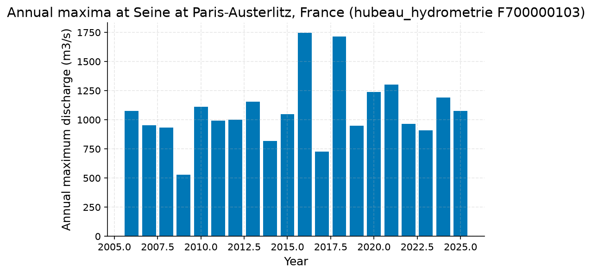
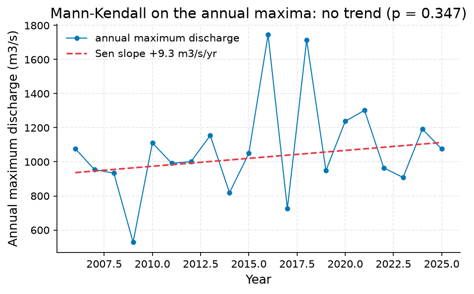

# Screen the 100-year daily-mean flood at Seine at Paris-Austerlitz, France; ident (48.84468962, 2.365510635)

**Author:** AquaScope Studio  
**Date:** 2026-09-23  
**Description:** Screen the 100-year daily-mean flood at Seine at Paris-Austerlitz, France; identify estimator uncertainty and limitations.  
**Version:** 1.0  

**Site:** 48.8447 N, 2.3655 E

**Answer.** Screen the 100-year daily-mean flood at Seine at Paris-Austerlitz, France; identify estimator uncertainty and limitations: 100-year return level, GEV (L-moments) 1951 m3/s (not established). The 100-year return level from 20 annual maxima: GEV by L-moments 1,951 m3/s; Log-Pearson III 1,828 m3/s (90 % confidence interval 1,513 to 2,208 m3/s); bootstrap GEV 1,839 m3/s (90 % confidence interval 1,375 to 2,478 m3/s). Mann-Kendall on the annual maxima: not significant at the 5 % level (p = 0.347, Sen's slope 9.298 m3/s per year over 20 years). The record at Seine at Paris-Austerlitz, France (hubeau_hydrometrie F700000103) runs from 2006-01-28 to 2026-09-21 (20.6 years, discharge in m3/s). The two fits differ by 6%.

*Key numbers*

| Quantity | Value | Unit | Step |
| --- | --- | --- | --- |
| Record length | 20.6 | years | s1 |
| 100-year return level, GEV (L-moments) | 1951.0 | m3/s | s1 |
| 100-year return level, Log-Pearson III | 1828.0 | m3/s | s1 |
| 100-year LP3 90 % interval, low | 1513.0 | m3/s | s1 |
| 100-year LP3 90 % interval, high | 2208.0 | m3/s | s1 |
| 100-year return level, GEV (MLE with L-moments fallback) | 1839.0 | m3/s | s1 |
| 100-year GEV bootstrap 90 % interval, low | 1375.0 | m3/s | s1 |
| 100-year GEV bootstrap 90 % interval, high | 2478.0 | m3/s | s1 |
| Q95 (exceeded 95 % of days) | 96.35 | m3/s | s1 |
| Q50 (median flow) | 227.3 | m3/s | s1 |
| Q10 | 675.2 | m3/s | s1 |
| Mann-Kendall p-value (annual maxima) | 0.3468 |  | s1 |
| Sen's slope | 9.298 | m3/s per year | s1 |
| 2-year return level, GEV (L-moments) | 1026.0 | m3/s | s1 |
| 2-year return level, Log-Pearson III | 1049.0 | m3/s | s1 |
| 5-year return level, GEV (L-moments) | 1276.0 | m3/s | s1 |
| 5-year return level, Log-Pearson III | 1300.0 | m3/s | s1 |
| 10-year return level, GEV (L-moments) | 1441.0 | m3/s | s1 |
| 10-year return level, Log-Pearson III | 1445.0 | m3/s | s1 |
| 25-year return level, GEV (L-moments) | 1648.0 | m3/s | s1 |
| 25-year return level, Log-Pearson III | 1611.0 | m3/s | s1 |
| 50-year return level, GEV (L-moments) | 1800.0 | m3/s | s1 |
| 50-year return level, Log-Pearson III | 1723.0 | m3/s | s1 |

## Summary

Screen the 100-year daily-mean flood at Seine at Paris-Austerlitz, France; identify estimator uncertainty and limitations.. The record: Seine at Paris-Austerlitz, France (hubeau_hydrometrie F700000103), 20.6 years. 1 step(s) ran (None plan, playbook flood_risk); 4 of 5 gates passed. Screen the 100-year daily-mean flood at Seine at Paris-Austerlitz, France; identify estimator uncertainty and limitations: 100-year return level, GEV (L-moments) 1951 m3/s (not established). 1 point(s) are listed under what this study does not establish.

## The decision

Screen the 100-year daily-mean flood at Seine at Paris-Austerlitz, France; identify estimator uncertainty and limitations: 100-year return level, GEV (L-moments) 1951 m3/s (not established). It holds under these conditions: The annual maxima are independent and drawn from a stationary distribution.; Daily mean maxima can understate instantaneous flood peaks.. Limitations and unresolved checks: step s1 did not pass max_return_period_factor: T = 100 years against a cap of about 60 years (3 times 20 years of record): beyond the cap, an extrapolation; Maintainer reproduction; independent hydrologist review pending.; Daily mean maxima are not instantaneous annual peaks or a certified design flood.. The grade applies to primary result and applicable supporting checks. What would change it: flood_frequency (s1) establishing its result: gate failed: max_return_period_factor (T = 100 years against a cap of about 60 years (3 times 20 years of record): beyond the cap, an extrapolation); the annual peak series of a nearby long gauge, or a regional growth curve: a regional curve keeps the estimate indicative but bounded. The crew would ask for the annual peak series of a nearby long gauge, or a regional growth curve: a regional curve keeps the estimate indicative but bounded.

## Findings

- [not established] Record length: 20.6 years (from s1.years)
- [not established] 100-year return level, GEV (L-moments): 1951 m3/s (from s1.ffa.fits.gev_lmoments.q.5)
- [not established] 100-year return level, Log-Pearson III: 1828 m3/s (from s1.ffa.fits.lp3.q.5)
- [not established] 100-year LP3 90 % interval, low: 1513 m3/s (from s1.ffa.fits.lp3.ci.5.0)
- [not established] 100-year LP3 90 % interval, high: 2208 m3/s (from s1.ffa.fits.lp3.ci.5.1)
- [not established] 100-year return level, GEV (MLE with L-moments fallback): 1839 m3/s (from s1.ffa.fits.gev_bootstrap.q.5)
- [not established] 100-year GEV bootstrap 90 % interval, low: 1375 m3/s (from s1.ffa.fits.lp3.ci.3.0)
- [not established] 100-year GEV bootstrap 90 % interval, high: 2478 m3/s (from s1.ffa.fits.gev_bootstrap.ci.5.1)
- [not established] Q95 (exceeded 95 % of days): 96.35 m3/s (from s1.fdc.q95)
- [not established] Q50 (median flow): 227.3 m3/s (from s1.fdc.q50)
- [not established] Q10: 675.2 m3/s (from s1.fdc.q.20)
- [not established] Mann-Kendall p-value (annual maxima): 0.3468 (from s1.ffa.amax_trend.p_value)
- [not established] Sen's slope: 9.298 m3/s per year (from s1.ffa.amax_trend.sens_slope_per_year)
- [not established] 2-year return level, GEV (L-moments): 1026 m3/s (from s1.ffa.fits.gev_lmoments.q.0)
- [not established] 2-year return level, Log-Pearson III: 1049 m3/s (from s1.ffa.fits.lp3.q.0)
- [not established] 5-year return level, GEV (L-moments): 1276 m3/s (from s1.ffa.fits.gev_lmoments.q.1)
- [not established] 5-year return level, Log-Pearson III: 1300 m3/s (from s1.ffa.fits.lp3.q.1)
- [not established] 10-year return level, GEV (L-moments): 1441 m3/s (from s1.ffa.fits.gev_lmoments.q.2)
- [not established] 10-year return level, Log-Pearson III: 1445 m3/s (from s1.ffa.fits.lp3.q.2)
- [not established] 25-year return level, GEV (L-moments): 1648 m3/s (from s1.ffa.fits.gev_lmoments.q.3)
- [not established] 25-year return level, Log-Pearson III: 1611 m3/s (from s1.ffa.fits.lp3.q.3)
- [not established] 50-year return level, GEV (L-moments): 1800 m3/s (from s1.ffa.fits.gev_lmoments.q.4)
- [not established] 50-year return level, Log-Pearson III: 1723 m3/s (from s1.ffa.fits.lp3.q.4)
- Agrees: spread 6% between 1,951, 1,828 (25% allowed) at T = 100 years
- Agrees: Mann-Kendall on the annual maxima: p = 0.347, tau = 0.16: no trend at the 0.05 level

## Problem and decision

Screen the 100-year daily-mean flood at Seine at Paris-Austerlitz, France; identify estimator uncertainty and limitations. Decision: Screen the 100-year daily-mean flood at Seine at Paris-Austerlitz, France; identify estimator uncertainty and limitations.. Intake: return_period = 100.

## Site and data

Site: 48.84468962, 2.365510635. No inventory.

## Methodology

Objective: Screen the 100-year daily-mean flood at Seine at Paris-Austerlitz, France; identify estimator uncertainty and limitations..

1. Compare GEV L-moments, LP3 and GEV MLE quantiles on complete-year daily maxima.

Step s1: `flood_frequency(source='hubeau_hydrometrie', station_id='F700000103', bootstrap_ci=True)`, method at_site_flood_frequency; gates: min_years 20 on ffa.n_years; unit_present on unit; max_return_period_factor 3 on ffa.n_years; spread_within 0.25 on ffa.fits.gev_lmoments.q, ffa.fits.lp3.q; trend_on_series 0.05 on ffa.amax_trend.

Assumptions: Independent stationary annual maxima..

## Results: step s1

The record at Seine at Paris-Austerlitz, France (hubeau_hydrometrie F700000103) runs from 2006-01-28 to 2026-09-21 (20.6 years, discharge in m3/s). Mann-Kendall on the annual maxima: not significant at the 5 % level (p = 0.347, Sen's slope 9.298 m3/s per year over 20 years). The 100-year return level from 20 annual maxima: GEV by L-moments 1,951 m3/s; Log-Pearson III 1,828 m3/s (90 % confidence interval 1,513 to 2,208 m3/s); bootstrap GEV 1,839 m3/s (90 % confidence interval 1,375 to 2,478 m3/s). The two fits differ by 6%. Flow duration: the flow exceeded on 95 % of days is 96.35 m3/s, the median 227.3 m3/s, the flow exceeded on 10 % of days 675.2 m3/s. Gates: min_years passed (20 years of record, 20 needed); unit_present passed (unit m3/s); max_return_period_factor FAILED (T = 100 years against a cap of about 60 years (3 times 20 years of record): beyond the cap, an extrapolation); spread_within passed (spread 6% between 1,951, 1,828 (25% allowed) at T = 100 years); trend_on_series passed (Mann-Kendall on the annual maxima: p = 0.347, tau = 0.16: no trend at the 0.05 level).


*Return levels of annual maximum discharge at Seine at Paris-Austerlitz, France (hubeau_hydrometrie F700000103): GEV (L-moments), Log-Pearson III, GEV (MLE, bootstrap interval) fits with the GEV bootstrap 90 % band, and the observed annual maxima at their Weibull plotting positions.*


*Annual maximum discharge at Seine at Paris-Austerlitz, France (hubeau_hydrometrie F700000103), 20 years (2006 to 2025).*


*Annual maximum discharge at Seine at Paris-Austerlitz, France (hubeau_hydrometrie F700000103) with the Sen slope line; the Mann-Kendall test on the annual maxima finds no trend (p = 0.347, 20 years).*

*Return levels at Seine at Paris-Austerlitz, France (hubeau_hydrometrie F700000103) by return period, with the confidence band.*

| T | GEV | LP3 | lower | upper |
| --- | --- | --- | --- | --- |
| 2.0 | 1026.2407 | 1048.6464 | 958.4099 | 1139.6632 |
| 5.0 | 1276.3426 | 1299.6422 | 1153.9574 | 1429.7973 |
| 10.0 | 1440.9042 | 1444.9753 | 1238.2279 | 1610.671 |
| 25.0 | 1647.6647 | 1610.5289 | 1316.6546 | 1884.2307 |
| 50.0 | 1800.2167 | 1723.1682 | 1355.6185 | 2150.9474 |
| 100.0 | 1950.9427 | 1828.2086 | 1375.0989 | 2478.0204 |

*Annual maxima at Seine at Paris-Austerlitz, France (hubeau_hydrometrie F700000103).*

| year | value |
| --- | --- |
| 2006 | 1077.219 |
| 2007 | 954.51 |
| 2008 | 933.518 |
| 2009 | 528.32 |
| 2010 | 1111.026 |
| 2011 | 991.932 |
| 2012 | 1000.716 |
| 2013 | 1154.701 |
| 2014 | 818.855 |
| 2015 | 1049.444 |
| 2016 | 1745.481 |
| 2017 | 725.596 |
| 2018 | 1714.135 |
| 2019 | 948.415 |
| 2020 | 1237.792 |
| 2021 | 1302.178 |
| 2022 | 964.35 |
| 2023 | 908.041 |
| 2024 | 1191.992 |
| 2025 | 1075.34 |

*Spread between the GEV and Log-Pearson III return levels at Seine at Paris-Austerlitz, France (hubeau_hydrometrie F700000103).*

| T | GEV | LP3 | spread_pct |
| --- | --- | --- | --- |
| 2.0 | 1026.2407 | 1048.6464 | 2.2 |
| 5.0 | 1276.3426 | 1299.6422 | 1.8 |
| 10.0 | 1440.9042 | 1444.9753 | 0.3 |
| 25.0 | 1647.6647 | 1610.5289 | 2.3 |
| 50.0 | 1800.2167 | 1723.1682 | 4.4 |
| 100.0 | 1950.9427 | 1828.2086 | 6.5 |

## Limitations and what this study does not establish

- Step s1, gate max_return_period_factor: T = 100 years against a cap of about 60 years (3 times 20 years of record): beyond the cap, an extrapolation

Caveats, verbatim from the playbook:
- Maintainer reproduction; independent hydrologist review pending.
- Daily mean maxima are not instantaneous annual peaks or a certified design flood.
- No catchment regulation, channel topology or model/gauge comparability was established.
- Re-run live uses current observations; use the retained CSV and this script for reproduction.

## What this study does not establish

- Step s1, gate max_return_period_factor: T = 100 years against a cap of about 60 years (3 times 20 years of record): beyond the cap, an extrapolation

## Caveats

- Maintainer reproduction; independent hydrologist review pending.
- Daily mean maxima are not instantaneous annual peaks or a certified design flood.
- No catchment regulation, channel topology or model/gauge comparability was established.
- Re-run live uses current observations; use the retained CSV and this script for reproduction.

## Recommendations

- Adopt this as the answer to the decision: Screen the 100-year daily-mean flood at Seine at Paris-Austerlitz, France; identify estimator uncertainty and limitations: 100-year return level, GEV (L-moments) 1951 m3/s (not established).
- To firm it up: flood_frequency (s1) establishing its result: gate failed: max_return_period_factor (T = 100 years against a cap of about 60 years (3 times 20 years of record): beyond the cap, an extrapolation).
- To firm it up: the annual peak series of a nearby long gauge, or a regional growth curve: a regional curve keeps the estimate indicative but bounded.
- Obtain the annual peak series of a nearby long gauge, or a regional growth curve: a regional curve keeps the estimate indicative but bounded.
- Read the numbers with this caveat: Maintainer reproduction; independent hydrologist review pending.

## References

1. England et al. (2019) Bulletin 17C
2. Hosking, J. R. M. (1990). L-moments: analysis and estimation of distributions using linear combinations of order statistics. J. R. Stat. Soc. B, 52(1), 105-124.
3. Vogel, R. M., & Fennessey, N. M. (1994). Flow-duration curves I: new interpretation and confidence intervals. J. Water Resour. Plann. Manage., 120(4), 485-504.
4. England, J. F. Jr. et al. (2018). Guidelines for determining flood flow frequency, Bulletin 17C. USGS Techniques and Methods 4-B5.
5. Mann, H. B. (1945). Nonparametric tests against trend. Econometrica, 13, 245-259
6. Sen, P. K. (1968). J. Am. Stat. Assoc., 63, 1379-1389.
7. Rekin226 and contributors. AquaScope Hydrology 0.18.0 [Software]. Release DOI: https://doi.org/10.5281/zenodo.22787700. All versions: https://doi.org/10.5281/zenodo.21903143. Analysis software revision: efe3a0e9f8469011f2f6ad9a8c87967dbf22072a; the release DOI does not archive later code changes.

## Appendix: reproducibility

Re-run the same steps with no model: `aquascope run study.yaml`. Resume the workspace: `aquascope studio --resume workspace.json`.

Model: none via none; ledger: no model calls. aquascope 0.18.0.

```yaml
# An AquaScope study (version 3): the plan behind an answer, its gates, and what happened.
#   aquascope run study.yaml
version: 3
title: "Daily-mean flood screening: Seine at Paris-Austerlitz, France"
question: "Screen the 100-year daily-mean flood at Seine at Paris-Austerlitz, France; identify estimator uncertainty and limitations."
created: "2026-09-23T03:43:13+00:00"
aquascope_version: "0.18.0"
author: "hand"
problem:
  kind: "flood_risk"
  site: {"lat": 48.84468962, "lon": 2.365510635}
  params: {"return_period": 100}
plan:
  playbook: "flood_risk"
  objective: "Screen the 100-year daily-mean flood at Seine at Paris-Austerlitz, France; identify estimator uncertainty and limitations."
  caveats: ["Maintainer reproduction; independent hydrologist review pending.", "Daily mean maxima are not instantaneous annual peaks or a certified design flood.", "No catchment regulation, channel topology or model/gauge comparability was established.", "Re-run live uses current observations; use the retained CSV and this script for reproduction."]
  methodology: ["Compare GEV L-moments, LP3 and GEV MLE quantiles on complete-year daily maxima."]
  assumptions: ["Independent stationary annual maxima."]
steps:
  - tool: "flood_frequency"
    id: "s1"
    method: "at_site_flood_frequency"
    arguments:
      source: "hubeau_hydrometrie"
      station_id: "F700000103"
      bootstrap_ci: true
    expects:
      - {"check": "min_years", "path": "ffa.n_years", "value": 20}
      - {"check": "unit_present", "path": "unit"}
      - {"check": "max_return_period_factor", "path": "ffa.n_years", "value": 3, "return_period": 100}
      - {"check": "spread_within", "paths": ["ffa.fits.gev_lmoments.q", "ffa.fits.lp3.q"], "value": 0.25, "return_period": 100}
      - {"check": "trend_on_series", "path": "ffa.amax_trend", "value": 0.05}
results:
  s1: {"ok": true, "gates": [{"check": "min_years", "passed": true, "detail": "20 years of record, 20 needed"}, {"check": "unit_present", "passed": true, "detail": "unit m3/s"}, {"check": "max_return_period_factor", "passed": false, "detail": "T = 100 years against a cap of about 60 years (3 times 20 years of record): beyond the cap, an extrapolation"}, {"check": "spread_within", "passed": true, "detail": "spread 6% between 1,951, 1,828 (25% allowed) at T = 100 years"}, {"check": "trend_on_series", "passed": true, "detail": "Mann-Kendall on the annual maxima: p = 0.347, tau = 0.16: no trend at the 0.05 level"}], "summary": "source=hubeau_hydrometrie, station_id=F700000103, variable=discharge, unit=m3/s, years=20.6, start=2006-01-28, end=2026-09-21", "fallback_used": false, "sha256": "4fdcb3025763345d", "failed_reason": "gate failed: max_return_period_factor (T = 100 years against a cap of about 60 years (3 times 20 years of record): beyond the cap, an extrapolation)"}
```

Result identities (also in findings.json and the Findings worksheet):
- 100-year return level, GEV (L-moments): result s1.ffa.fits.gev_lmoments.q.5; estimator gev_lmoments; annual maxima of daily mean discharge; years with at least 292 observed days. Input hubeau_hydrometrie/F700000103, discharge, m3/s, 2006-01-28 to 2026-09-21; content sha256:d4d7063849d42170f8436229fdafe83a286f01c37816bd6ab10bdcbb19393e58. Software 0.18.0; revision efe3a0e9f8469011f2f6ad9a8c87967dbf22072a. Archive revision not recorded; content hash is not an archive DOI. No interval for this estimator.
- 100-year return level, Log-Pearson III: result s1.ffa.fits.lp3.q.5; estimator lp3_log_moments; annual maxima of daily mean discharge; years with at least 292 observed days. Input hubeau_hydrometrie/F700000103, discharge, m3/s, 2006-01-28 to 2026-09-21; content sha256:d4d7063849d42170f8436229fdafe83a286f01c37816bd6ab10bdcbb19393e58. Software 0.18.0; revision efe3a0e9f8469011f2f6ad9a8c87967dbf22072a. Archive revision not recorded; content hash is not an archive DOI. Own interval [1513.4511, 2208.4273], method variance_of_estimate, level 0.9.
- 100-year return level, GEV (MLE with L-moments fallback): result s1.ffa.fits.gev_bootstrap.q.5; estimator gev_mle_with_lmoments_fallback; annual maxima of daily mean discharge; years with at least 292 observed days. Input hubeau_hydrometrie/F700000103, discharge, m3/s, 2006-01-28 to 2026-09-21; content sha256:d4d7063849d42170f8436229fdafe83a286f01c37816bd6ab10bdcbb19393e58. Software 0.18.0; revision efe3a0e9f8469011f2f6ad9a8c87967dbf22072a. Archive revision not recorded; content hash is not an archive DOI. Own interval [1375.0989, 2478.0204], method nonparametric_bootstrap_percentile, level 0.9.
- 2-year return level, GEV (L-moments): result s1.ffa.fits.gev_lmoments.q.0; estimator gev_lmoments; annual maxima of daily mean discharge; years with at least 292 observed days. Input hubeau_hydrometrie/F700000103, discharge, m3/s, 2006-01-28 to 2026-09-21; content sha256:d4d7063849d42170f8436229fdafe83a286f01c37816bd6ab10bdcbb19393e58. Software 0.18.0; revision efe3a0e9f8469011f2f6ad9a8c87967dbf22072a. Archive revision not recorded; content hash is not an archive DOI. No interval for this estimator.
- 2-year return level, Log-Pearson III: result s1.ffa.fits.lp3.q.0; estimator lp3_log_moments; annual maxima of daily mean discharge; years with at least 292 observed days. Input hubeau_hydrometrie/F700000103, discharge, m3/s, 2006-01-28 to 2026-09-21; content sha256:d4d7063849d42170f8436229fdafe83a286f01c37816bd6ab10bdcbb19393e58. Software 0.18.0; revision efe3a0e9f8469011f2f6ad9a8c87967dbf22072a. Archive revision not recorded; content hash is not an archive DOI. Own interval [946.4268, 1161.9064], method variance_of_estimate, level 0.9.
- 5-year return level, GEV (L-moments): result s1.ffa.fits.gev_lmoments.q.1; estimator gev_lmoments; annual maxima of daily mean discharge; years with at least 292 observed days. Input hubeau_hydrometrie/F700000103, discharge, m3/s, 2006-01-28 to 2026-09-21; content sha256:d4d7063849d42170f8436229fdafe83a286f01c37816bd6ab10bdcbb19393e58. Software 0.18.0; revision efe3a0e9f8469011f2f6ad9a8c87967dbf22072a. Archive revision not recorded; content hash is not an archive DOI. No interval for this estimator.
- 5-year return level, Log-Pearson III: result s1.ffa.fits.lp3.q.1; estimator lp3_log_moments; annual maxima of daily mean discharge; years with at least 292 observed days. Input hubeau_hydrometrie/F700000103, discharge, m3/s, 2006-01-28 to 2026-09-21; content sha256:d4d7063849d42170f8436229fdafe83a286f01c37816bd6ab10bdcbb19393e58. Software 0.18.0; revision efe3a0e9f8469011f2f6ad9a8c87967dbf22072a. Archive revision not recorded; content hash is not an archive DOI. Own interval [1152.1852, 1465.9707], method variance_of_estimate, level 0.9.
- 10-year return level, GEV (L-moments): result s1.ffa.fits.gev_lmoments.q.2; estimator gev_lmoments; annual maxima of daily mean discharge; years with at least 292 observed days. Input hubeau_hydrometrie/F700000103, discharge, m3/s, 2006-01-28 to 2026-09-21; content sha256:d4d7063849d42170f8436229fdafe83a286f01c37816bd6ab10bdcbb19393e58. Software 0.18.0; revision efe3a0e9f8469011f2f6ad9a8c87967dbf22072a. Archive revision not recorded; content hash is not an archive DOI. No interval for this estimator.
- 10-year return level, Log-Pearson III: result s1.ffa.fits.lp3.q.2; estimator lp3_log_moments; annual maxima of daily mean discharge; years with at least 292 observed days. Input hubeau_hydrometrie/F700000103, discharge, m3/s, 2006-01-28 to 2026-09-21; content sha256:d4d7063849d42170f8436229fdafe83a286f01c37816bd6ab10bdcbb19393e58. Software 0.18.0; revision efe3a0e9f8469011f2f6ad9a8c87967dbf22072a. Archive revision not recorded; content hash is not an archive DOI. Own interval [1258.3073, 1659.3351], method variance_of_estimate, level 0.9.
- 25-year return level, GEV (L-moments): result s1.ffa.fits.gev_lmoments.q.3; estimator gev_lmoments; annual maxima of daily mean discharge; years with at least 292 observed days. Input hubeau_hydrometrie/F700000103, discharge, m3/s, 2006-01-28 to 2026-09-21; content sha256:d4d7063849d42170f8436229fdafe83a286f01c37816bd6ab10bdcbb19393e58. Software 0.18.0; revision efe3a0e9f8469011f2f6ad9a8c87967dbf22072a. Archive revision not recorded; content hash is not an archive DOI. No interval for this estimator.
- 25-year return level, Log-Pearson III: result s1.ffa.fits.lp3.q.3; estimator lp3_log_moments; annual maxima of daily mean discharge; years with at least 292 observed days. Input hubeau_hydrometrie/F700000103, discharge, m3/s, 2006-01-28 to 2026-09-21; content sha256:d4d7063849d42170f8436229fdafe83a286f01c37816bd6ab10bdcbb19393e58. Software 0.18.0; revision efe3a0e9f8469011f2f6ad9a8c87967dbf22072a. Archive revision not recorded; content hash is not an archive DOI. Own interval [1371.9955, 1890.5334], method variance_of_estimate, level 0.9.
- 50-year return level, GEV (L-moments): result s1.ffa.fits.gev_lmoments.q.4; estimator gev_lmoments; annual maxima of daily mean discharge; years with at least 292 observed days. Input hubeau_hydrometrie/F700000103, discharge, m3/s, 2006-01-28 to 2026-09-21; content sha256:d4d7063849d42170f8436229fdafe83a286f01c37816bd6ab10bdcbb19393e58. Software 0.18.0; revision efe3a0e9f8469011f2f6ad9a8c87967dbf22072a. Archive revision not recorded; content hash is not an archive DOI. No interval for this estimator.
- 50-year return level, Log-Pearson III: result s1.ffa.fits.lp3.q.4; estimator lp3_log_moments; annual maxima of daily mean discharge; years with at least 292 observed days. Input hubeau_hydrometrie/F700000103, discharge, m3/s, 2006-01-28 to 2026-09-21; content sha256:d4d7063849d42170f8436229fdafe83a286f01c37816bd6ab10bdcbb19393e58. Software 0.18.0; revision efe3a0e9f8469011f2f6ad9a8c87967dbf22072a. Archive revision not recorded; content hash is not an archive DOI. Own interval [1446.1473, 2053.2546], method variance_of_estimate, level 0.9.

## Cite this software

Rekin226 and contributors. AquaScope Hydrology 0.18.0 [Software]. Release DOI: https://doi.org/10.5281/zenodo.22787700. All versions: https://doi.org/10.5281/zenodo.21903143. Analysis software revision: efe3a0e9f8469011f2f6ad9a8c87967dbf22072a; the release DOI does not archive later code changes.


---

*{'model': None, 'provider': None, 'prose': 'template', 'tokens': {}, 'total_tokens': 0, 'total_usd': None, 'budget': None, 'dropped': 0, 'aquascope_version': '0.18.0', 'date': '2026-09-23 03:43 UTC', 'workspace': 'ee1191ce39c4', 'plan_author': 'hand', 'written_by': {'answer': 'template', 'summary': 'template', 'decision': 'template', 'findings': 'template', 'problem': 'template', 'site_data': 'template', 'methodology': 'template', 'results-s1': 'template', 'limitations': 'template', 'recommendations': 'template', 'references': 'template', 'appendix': 'template'}}*
